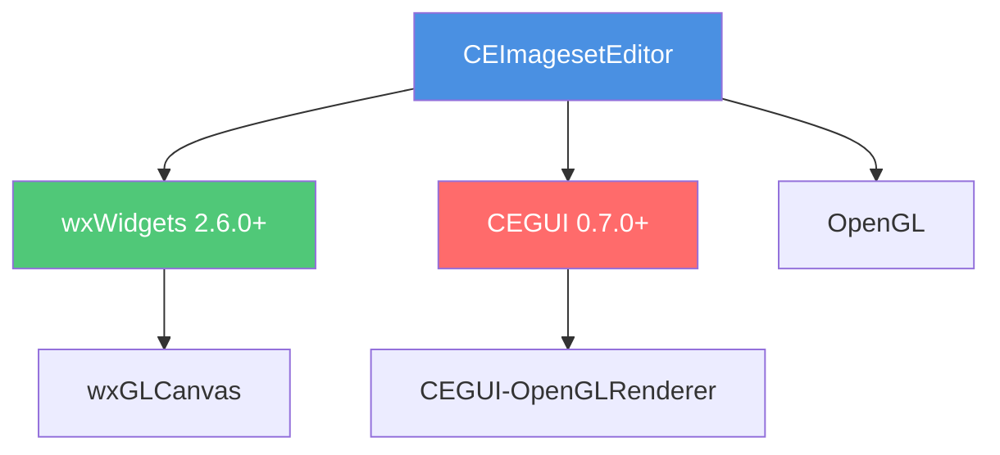
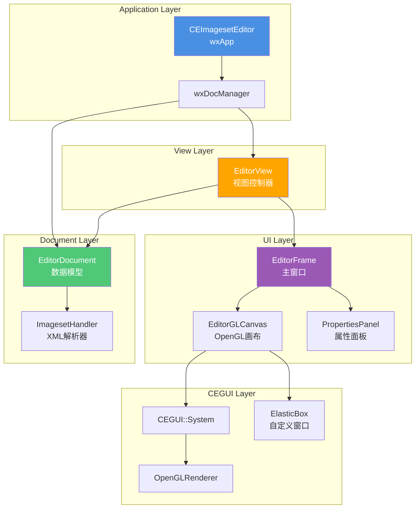
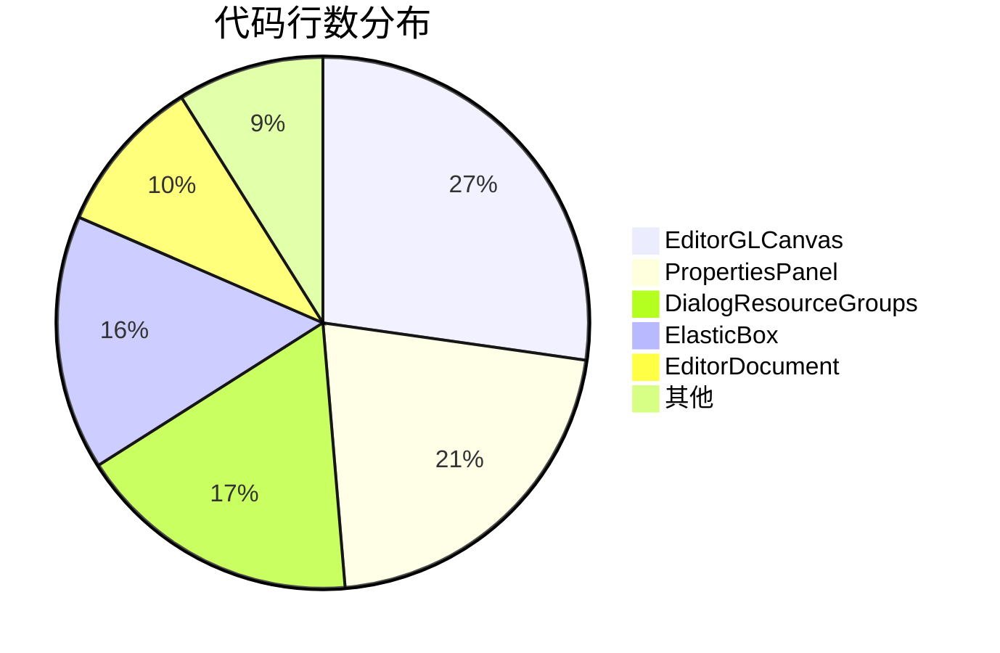

# 项目概览 (Project Overview)

## 简介 (Introduction)

**CEImagesetEditor** 是一个专业的图形化工具,用于创建和编辑 [CEGUI](http://www.cegui.org.uk) (Crazy Eddie's GUI System) Imageset 文件。它基于 **wxWidgets** 跨平台 GUI 框架开发,集成了 **CEGUI** 渲染引擎和 **OpenGL** 图形库,为游戏和应用程序的 GUI 开发提供了可视化的图像区域管理环境。

### 核心功能

- **可视化编辑**: 直观的界面定义和修改纹理上的图像区域
- **实时预览**: 集成 CEGUI 渲染,实时验证 Imageset 效果
- **跨平台支持**: 兼容 Windows、Linux 和 macOS
- **标准格式**: 完全支持 CEGUI Imageset XML 格式
- **自动缩放**: 处理分辨率缩放和原生分辨率设置的工具

### 项目历史

| 版本 | 发布时间 | 主要变更 |
|------|---------|---------|
| **0.7.1** | 当前版本 | 稳定版本,支持 CEGUI 0.7.0+ |
| **0.6.2** | 2008 | 修复拖动缩放问题,改进坐标系统 |
| **0.6.1** | 2007 | 添加 macOS 支持,分发 XSD 文件 |
| **0.6.0** | 2007 | 添加 Visual Studio 解决方案,版本号与 CEGUI 同步 |
| **0.1.0** | 2006 | 初始版本(Martin Fleurent 原创) |

---

## 技术栈 (Technology Stack)

### 核心依赖



#### 1. wxWidgets (2.6.0 或更高版本)

**用途**: 跨平台 GUI 框架

**使用的组件**:
- `wxDocView`: 文档-视图架构框架
- `wxGLCanvas`: OpenGL 渲染画布
- `wxGrid`: 属性面板的表格控件
- `wxSplitterWindow`: 分割窗口布局
- `wxXmlDocument`: XML 文件处理(资源组配置)

**链接库**:
```bash
# Linux/macOS
wx-config --libs gl,core,adv

# Windows (Visual Studio)
wxmsw30u_core.lib wxmsw30u_gl.lib wxmsw30u_adv.lib
```

#### 2. CEGUI (0.7.0 或更高版本)

**用途**: GUI 渲染引擎和 Imageset 管理

**使用的模块**:
- `CEGUI::System`: 核心系统
- `CEGUI::OpenGLRenderer`: OpenGL 渲染器
- `CEGUI::ImagesetManager`: Imageset 管理
- `CEGUI::WindowManager`: 窗口(ElasticBox)管理
- `CEGUI::XMLParser`: XML 解析(SAX2)

**链接库**:
```bash
# pkg-config
pkg-config --libs CEGUI-OPENGL

# 典型输出
-lCEGUIBase -lCEGUIOpenGLRenderer
```

#### 3. OpenGL

**用途**: 硬件加速图形渲染

**最低版本**: OpenGL 1.4

**使用的功能**:
- 2D 纹理渲染
- 正交投影
- 基本的混合和透明度

### 编程语言

- **C++** (C++98/03 标准)
- **编译器要求**:
  - GCC 4.x+ (Linux/macOS)
  - Visual Studio 2003+ (Windows)
  - Xcode 3.x+ (macOS)

### 构建系统

| 平台 | 构建系统 | 配置文件 |
|------|---------|---------|
| **Linux/macOS** | Autotools | `configure.ac`, `Makefile.am` |
| **Windows** | Visual Studio | `vc++7.1/`, `vc++8/`, `vc++9/` |
| **macOS** | Xcode | `Xcode/CEImagesetEditor.xcodeproj` |

---

## 目录结构 (Directory Structure)

```
CEImagesetEditor-0.7.1/
├── src/                          # 源代码文件 (.cpp)
│   ├── CEImagesetEditor.cpp      # 应用程序入口
│   ├── EditorDocument.cpp        # 文档模型
│   ├── EditorView.cpp            # 视图控制器
│   ├── EditorFrame.cpp           # 主窗口
│   ├── EditorGLCanvas.cpp        # OpenGL 渲染画布
│   ├── PropertiesPanel.cpp       # 属性面板
│   ├── ImagesetHandler.cpp       # XML 解析器
│   ├── ElasticBox.cpp            # 自定义 CEGUI 窗口
│   ├── ElasticBoxProperties.cpp  # ElasticBox 属性
│   ├── ElasticBoxWindowRenderer.cpp # ElasticBox 渲染器
│   ├── DialogAbout.cpp           # 关于对话框
│   ├── DialogResourceGroups.cpp  # 资源组编辑器
│   ├── wxPathCellEditor.cpp      # 自定义网格编辑器
│   └── Makefile.am               # Automake 配置
│
├── inc/                          # 头文件 (.h)
│   ├── CEImagesetEditor.h
│   ├── EditorDocument.h
│   ├── EditorView.h
│   ├── EditorFrame.h
│   ├── EditorGLCanvas.h
│   ├── PropertiesPanel.h
│   ├── ImagesetHandler.h
│   ├── ElasticBox.h
│   ├── ElasticBoxProperties.h
│   ├── ElasticBoxWindowRenderer.h
│   ├── DialogAbout.h
│   ├── DialogResourceGroups.h
│   ├── wxPathCellEditor.h
│   ├── CEGUIHelper.h             # CEGUI 辅助函数
│   └── Config.h                  # 配置头文件
│
├── data/                         # 资源文件
│   ├── CEImagesetEditor.imageset # 编辑器自身的 Imageset
│   ├── CEImagesetEditor.looknfeel# 外观定义
│   ├── CEImagesetEditor.scheme   # CEGUI Scheme
│   ├── CEImagesetEditor.tga      # 纹理文件
│   ├── Imageset.xsd              # Imageset XML Schema
│   ├── GUIScheme.xsd             # Scheme XML Schema
│   └── Falagard.xsd              # Falagard XML Schema
│
├── docs/                         # 技术文档
│   ├── index.md                  # 文档索引
│   ├── 01_项目概览_Project_Overview.md
│   ├── 02_核心核心模块_Core_Modules.md
│   ├── 03_数据处理_Data_Handling.md
│   ├── 04_用户界面架构_UI_Architecture.md
│   ├── 05_API_Reference.md
│   ├── 06_详细类参考_Detailed_Class_Reference.md
│   ├── 07_工作流程与事件处理_Workflows_and_Events.md
│   ├── 08_依赖管理与构建系统_Dependencies_and_Build.md
│   └── 09_高级主题与扩展_Advanced_Topics.md
│
├── vc++7.1/                      # Visual Studio .NET 2003 项目
│   ├── CEImagesetEditor.sln
│   └── CEImagesetEditor.vcproj
│
├── vc++8/                        # Visual Studio 2005 项目
│   ├── CEImagesetEditor.sln
│   └── CEImagesetEditor.vcproj
│
├── vc++9/                        # Visual Studio 2008 项目
│   ├── CEImagesetEditor.sln
│   └── CEImagesetEditor.vcproj
│
├── Xcode/                        # Xcode 项目
│   └── CEImagesetEditor.xcodeproj
│
├── wxWidgets-3.0.5/              # 捆绑的 wxWidgets 源代码(可选)
│
├── configure.ac                  # Autoconf 配置
├── Makefile.am                   # Automake 配置
├── configure                     # 生成的配置脚本
├── Makefile.in                   # 生成的 Makefile 模板
├── Config.h.in                   # 配置头文件模板
├── README.md                     # 项目说明
├── AUTHORS                       # 作者列表
├── COPYING                       # GPL 许可证
├── ChangeLog                     # 变更日志
├── INSTALL                       # 安装说明
└── releasenotes.txt              # 发布说明
```

### 关键目录说明

- **`src/`**: 包含所有 C++ 实现文件,按功能模块组织
- **`inc/`**: 包含所有头文件,与 `src/` 一一对应
- **`data/`**: 存放编辑器运行时需要的资源文件和 XML Schema
- **`docs/`**: 完整的技术文档,采用 Markdown 格式
- **`vc++*/`**: 不同版本的 Visual Studio 项目文件
- **`Xcode/`**: macOS 平台的 Xcode 项目

---

## 核心架构概览 (Architecture Overview)

### 设计模式

CEImagesetEditor 采用经典的 **Document-View** 架构模式,结合 **Observer** 和 **MVC** 模式的元素。



### 架构层次

#### 1. Application Layer (应用层)

**职责**: 应用程序生命周期管理

**核心类**: `CEImagesetEditor` (继承自 `wxApp`)

**功能**:
- 初始化 wxWidgets 和 CEGUI
- 创建文档管理器 (`wxDocManager`)
- 注册文档模板
- 创建主窗口
- 处理全局事件(退出、关于)

#### 2. Document Layer (文档层)

**职责**: 数据模型和业务逻辑

**核心类**: `EditorDocument` (继承自 `wxDocument`)

**数据结构**:
```cpp
class EditorDocument {
    wxString m_imagesetName;              // Imageset 名称
    wxString m_imageFilename;             // 图片文件路径
    wxPoint m_nativeResolution;           // 原生分辨率
    bool m_autoScaled;                    // 自动缩放标志
    mapNamedRegion m_mapSetRectangles;    // Region 名称 -> wxRect 映射
};
```

**功能**:
- 存储 Imageset 的所有数据
- 提供数据操作接口(增删改查 Region)
- 文件 I/O (XML 解析和序列化)
- 通知视图数据变更(Observer 模式)

#### 3. View Layer (视图层)

**职责**: 连接文档和 UI,协调数据流

**核心类**: `EditorView` (继承自 `wxView`)

**功能**:
- 响应文档数据变化
- 更新 UI 组件(Canvas、PropertiesPanel)
- 管理状态栏信息
- 处理视图生命周期

#### 4. UI Layer (用户界面层)

**职责**: 用户交互和可视化呈现

**核心类**:
- `EditorFrame`: 主窗口容器
- `EditorGLCanvas`: OpenGL 渲染画布
- `PropertiesPanel`: 属性编辑面板

**布局结构**:
```
EditorFrame
├── MenuBar (文件、编辑、视图、帮助)
├── ToolBar (快捷操作)
└── wxSplitterWindow
    ├── EditorGLCanvas (70% 宽度)
    └── PropertiesPanel (30% 宽度)
```

#### 5. CEGUI Layer (渲染层)

**职责**: 图形渲染和自定义 GUI 组件

**核心类**:
- `CEGUI::System`: CEGUI 核心系统
- `CEGUI::OpenGLRenderer`: OpenGL 渲染器
- `ElasticBox`: 自定义可拖动边框窗口

---

## 核心设计决策 (Design Decisions)

### 为什么选择 Document-View 模式?

**优势**:
1. **数据与表现分离**: `EditorDocument` 专注于数据,`EditorView` 专注于显示
2. **支持多视图**: 理论上可以同时打开多个视图(虽然当前限制为 1)
3. **撤销/重做支持**: wxWidgets 的 `wxCommandProcessor` 与 Document-View 无缝集成
4. **文件管理**: `wxDocManager` 自动处理"新建"、"打开"、"保存"、"关闭"逻辑

**权衡**:
- 增加了代码复杂度(需要维护 Document、View、Frame 三层)
- 事件传播路径较长(UI → View → Document → View → UI)

### 为什么使用 CEGUI 渲染 Imageset?

**原因**:
1. **一致性**: 编辑器中看到的效果与游戏中完全一致
2. **实时预览**: 无需导出即可验证 Region 定义
3. **复用代码**: 直接使用 CEGUI 的 Imageset 加载和渲染逻辑

### 为什么创建自定义 ElasticBox 窗口?

**原因**:
1. **CEGUI 原生不支持**: 标准 CEGUI 没有可拖动调整大小的边框窗口
2. **精确控制**: 需要 8 个拖动热点和自定义光标形状
3. **事件集成**: 需要与 wxWidgets 事件系统集成

---

## 项目统计 (Project Statistics)

| 指标 | 数量 |
|------|------|
| **源文件 (.cpp)** | 13 |
| **头文件 (.h)** | 15 |
| **总代码行数** | ~8,000 行 |
| **核心类数量** | 12 |
| **支持的平台** | 3 (Windows, Linux, macOS) |
| **支持的构建系统** | 3 (Autotools, Visual Studio, Xcode) |
| **文档文件** | 11 |

### 代码分布



---

## 下一步

- 查看 [核心模块](02_核心核心模块_Core_Modules.md) 了解详细的类设计
- 查看 [数据处理](03_数据处理_Data_Handling.md) 了解 XML 解析流程
- 查看 [用户界面架构](04_用户界面架构_UI_Architecture.md) 了解 UI 组件
- 查看 [依赖管理与构建系统](08_依赖管理与构建系统_Dependencies_and_Build.md) 了解如何编译项目
