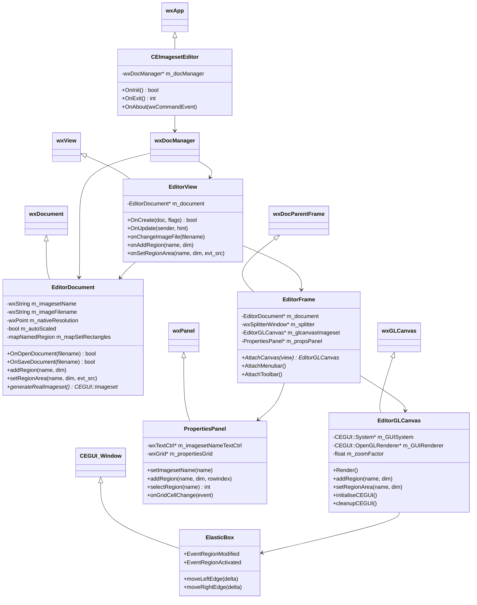
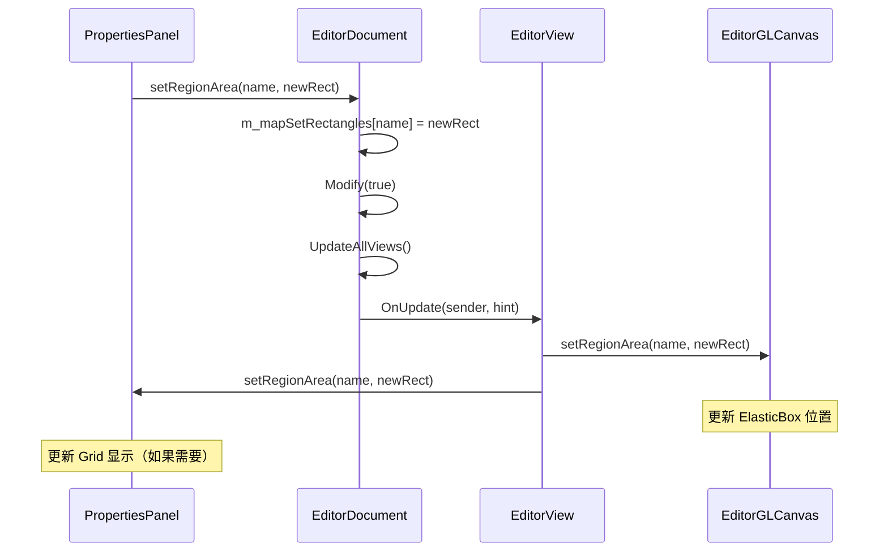

# 核心模块 (Core Modules)

## 1. 应用程序入口 (Application Entry)

### `CEImagesetEditor`

**继承关系**: `wxApp`

**功能**: 
- 初始化应用程序
- 管理文档-视图框架
- 处理全局事件（如 OnExit, OnAbout）

**关键方法**:

#### `OnInit()`
应用程序的 main 函数等价物。

**执行流程**:
1. 创建 `wxDocManager` 文档管理器
2. 注册 PNG 图片处理器（`wxPNGHandler`）
3. 创建文档模板，关联 `.xml`/`.imageset` 文件到 `EditorDocument` 和 `EditorView`
4. 限制最大同时打开文档数为 1（单文档界面 SDI）
5. 创建主窗口 `EditorFrame` (800x600 默认尺寸)
6. 显示窗口并初始化 OpenGL Canvas
7. 捕获 `CEGUI::Exception` 并记录错误

```cpp
bool CEImagesetEditor::OnInit() {
    m_docManager = new wxDocManager;
    wxImage::AddHandler(new wxPNGHandler);
    
    new wxDocTemplate(
        m_docManager, 
        "imageset files", 
        "*.xml;*.imageset", 
        "", 
        "xml", 
        "Editor Document", 
        "Editor View",
        CLASSINFO(EditorDocument), 
        CLASSINFO(EditorView)
    );
    
    m_docManager->SetMaxDocsOpen(1);
    
    GlobalFrame = new EditorFrame(/*...*/);
    GlobalFrame->Show(true);
    GlobalFrame->AttachCanvas(0); // 必须在窗口显示后
    
    return true;
}
```

#### `OnExit()`
清理资源，销毁文档管理器。

---

## 2. 文档模型 (Document Model)

### `EditorDocument`

**继承关系**: `wxDocument`

**职责**: 
- 存储 Imageset 的所有数据（名称、图片文件、分辨率、Region 定义）
- 提供数据操作接口
- 负责文件的加载（XML 解析）和保存（XML 序列化）

**关键属性**:

| 成员变量 | 类型 | 说明 |
|---|---|---|
| `m_imagesetName` | `wxString` | Imageset 名称 |
| `m_imageFilename` | `wxString` | 关联的图片文件路径 |
| `m_nativeResolution` | `wxPoint` | 原生分辨率 (默认 640x480) |
| `m_autoScaled` | `bool` | 是否启用自动缩放 |
| `m_mapSetRectangles` | `mapNamedRegion` | Region 名称到 `wxRect` 的哈希映射 |

**关键方法**:

#### Region 管理

- `addRegion(name, dim)`: 添加新的图片区域定义
- `deleteRegion(name)`: 删除指定的 Region
- `setRegionArea(name, dim, evt_src)`: 更新区域矩形（`evt_src` 防止循环更新）
- `renameRegion(currentname, newname)`: 重命名 Region，检查名称冲突
- `getRegionArea(name)`: 查询 Region 的矩形区域

#### 文件操作

- `OnOpenDocument(filename)`: 使用 `ImagesetHandler` 解析 XML
- `OnSaveDocument(filename)`: 调用 `generateRealImageset()` 并序列化
- `generateRealImageset()`: 根据内存数据生成临时 CEGUI Imageset

**数据流向**:
```
XML 文件 → ImagesetHandler → EditorDocument → EditorView → UI 组件
```

---

### 类图 (Comprehensive Class Diagram)



---

## 3. 视图层 (View Layer)

### `EditorView`

**继承关系**: `wxView`

**职责**: 
- 连接 `EditorDocument` 和 UI 组件（`EditorGLCanvas`、`PropertiesPanel`）
- 响应 Document 数据变化并更新 UI
- 管理状态栏信息

**事件响应方法**:

| 方法 | 触发时机 | 操作 |
|---|---|---|
| `onChangeImageFile(filename)` | 图片文件改变 | 通知 Canvas 加载新图片 |
| `onChangeImagesetName(name)` | Imageset 名称改变 | 更新窗口标题 |
| `onAddRegion(name, dim)` | 添加 Region | 在 Canvas 和 PropertiesPanel 中创建 ElasticBox 和表格行 |
| `onSetRegionArea(name, dim, evt_src)` | Region 尺寸改变 | 同步更新 ElasticBox 位置和表格数值 |
| `onRenameRegion(currentname, newname)` | Region 重命名 | 更新 CEGUI 窗口名称和表格内容 |

**状态栏管理**:
- `updateMouseStatusBar(x, y)`: 显示鼠标坐标
- `updateDocStatusBar(zoom, width, height)`: 显示缩放比例和图片尺寸

---

## 4. 主窗口 (Main Window)

### `EditorFrame`

**继承关系**: `wxDocParentFrame`

**UI 组件层次结构**:

```
EditorFrame
├── MenuBar
│   ├── File (New, Open, Save, Exit)
│   ├── Edit (Undo, Redo, Add Region, Delete Region)
│   ├── View (Background Color, Resource Groups)
│   └── Help (About)
├── ToolBar
│   └── Quick access buttons
└── wxSplitterWindow (m_splitter)
    ├── EditorGLCanvas (Left, 70% width)
    └── PropertiesPanel (Right, 30% width)
```

**关键成员变量**:

```cpp
EditorDocument* m_document;            // 当前文档
wxSplitterWindow* m_splitter;          // 分割窗口
PropertiesPanel* m_propsPanel;         // 属性面板
EditorGLCanvas* m_glcanvasImageset;    // OpenGL 画布
DialogResourceGroups* m_resGrpsEditor; // 资源组编辑对话框
wxColour m_backgroundColour;           // Canvas 背景颜色
```

**菜单事件处理**:
- `OnChangeBackgroundColour()`: 打开 `wxColourDialog` 选择背景色
- `OnEditResourceGroups()`: 打开资源组配置对话框

---

## 模块间通信机制 (Inter-Module Communication)

### 数据变更通知流程



### 关键设计模式

#### 1. Document-View 模式
- **Document** (`EditorDocument`): 数据模型
- **View** (`EditorView`): 视图控制器
- **优势**: 数据和表现分离，支持多视图

#### 2. Observer 模式
- `wxDocument::UpdateAllViews()` 通知所有观察者
- `EditorView::OnUpdate()` 响应通知

#### 3. MVC 变体
- **Model**: `EditorDocument`
- **View**: `EditorGLCanvas` + `PropertiesPanel`  
- **Controller**: `EditorView` + 各种事件处理器


