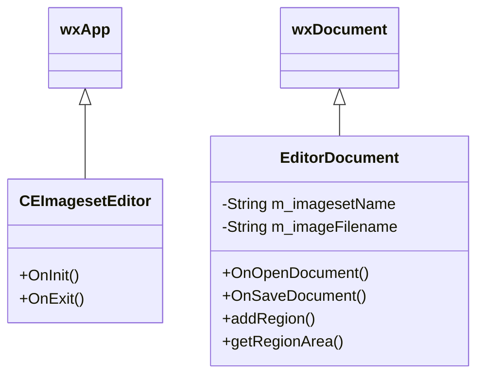

# 核心模块 (Core Modules)

## 1. 应用程序入口 (Application Entry)
### `CEImagesetEditor`
继承自 `wxApp`。
- **功能**: 初始化应用程序，处理全局事件（如 OnExit, OnAbout）。
- **关键方法**:
  - `OnInit()`: 初始化主框架 `EditorFrame` 和文档管理器 `wxDocManager`。
  - `OnExit()`: 清理资源。

## 2. 文档模型 (Document Model)
### `EditorDocument`
继承自 `wxDocument`。
- **功能**: 存储 Imageset 的元数据（名称、图片文件、分辨率）和 Region 定义。
- **关键属性**:
  - `m_imagesetName`: Imageset 名称。
  - `m_imageFilename`: 关联的图片文件名。
  - `m_mapSetRectangles`: 存储 Region 名称到 `wxRect` 的映射。
- **关键方法**:
  - `OnOpenDocument(filename)`: 打开并解析 Imageset XML。
  - `OnSaveDocument(filename)`: 保存当前状态为 XML。
  - `addRegion(name, dim)`: 添加新的图片区域。

### 类图 (Class Diagram)

