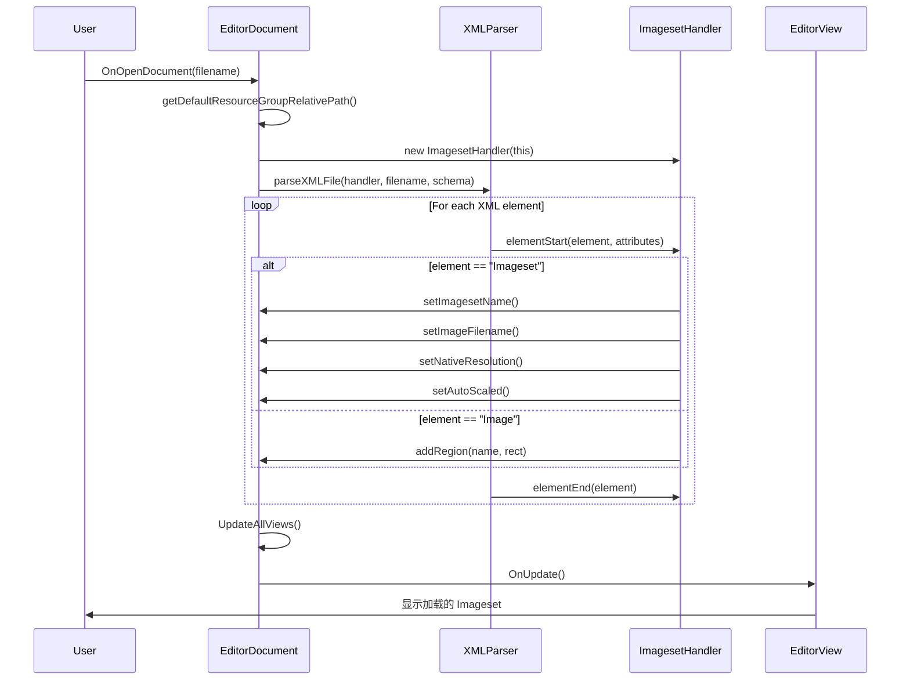
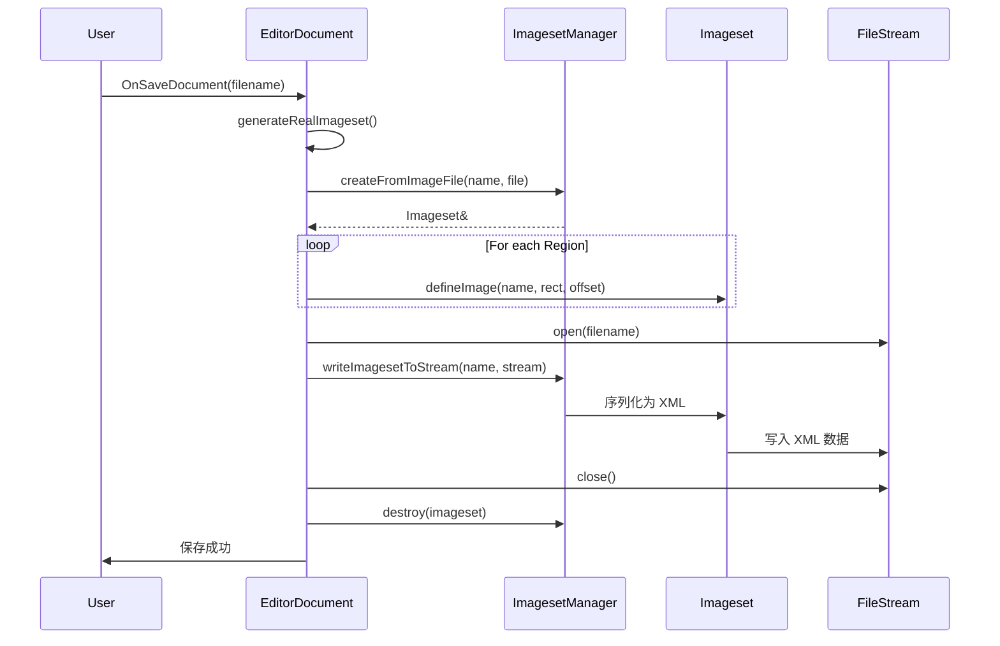
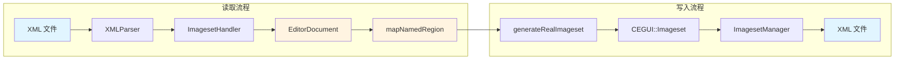

# 数据处理 (Data Handling)

## 概述 (Overview)

CEImagesetEditor 使用 **CEGUI 的 SAX2 XML 解析器**来读取 Imageset 文件,并使用 **CEGUI::ImagesetManager** 来序列化数据。数据处理流程包括:

1. **XML 解析**: 从文件读取 → SAX2 事件 → 内存数据结构
2. **内存管理**: `EditorDocument` 维护 Region 定义的 HashMap
3. **XML 生成**: 内存数据 → CEGUI Imageset → XML 序列化 → 文件

---

## CEGUI Imageset XML 格式规范

### XML Schema 定义

Imageset 文件遵循 `Imageset.xsd` 定义的 XML Schema:

```xml
<?xml version="1.0"?>
<xsd:schema xmlns:xsd="http://www.w3.org/2001/XMLSchema" elementFormDefault="qualified">
    <xsd:element name="Imageset" type="ImagesetType"/>
    
    <xsd:complexType name="ImagesetType">
        <xsd:sequence>
            <xsd:element name="Image" type="ImageType" maxOccurs="unbounded"/>
        </xsd:sequence>
        <xsd:attribute name="Imagefile" type="xsd:string" use="required"/>
        <xsd:attribute name="ResourceGroup" type="xsd:string" use="optional" default=""/>
        <xsd:attribute name="Name" type="xsd:string" use="required"/>
        <xsd:attribute name="NativeHorzRes" type="xsd:nonNegativeInteger" use="optional" default="640"/>
        <xsd:attribute name="NativeVertRes" type="xsd:nonNegativeInteger" use="optional" default="480"/>
        <xsd:attribute name="AutoScaled" type="xsd:boolean" use="optional" default="false"/>
    </xsd:complexType>
    
    <xsd:complexType name="ImageType">
        <xsd:attribute name="Name" type="xsd:string" use="required"/>
        <xsd:attribute name="XPos" type="xsd:nonNegativeInteger" use="required"/>
        <xsd:attribute name="YPos" type="xsd:nonNegativeInteger" use="required"/>
        <xsd:attribute name="Width" type="xsd:nonNegativeInteger" use="required"/>
        <xsd:attribute name="Height" type="xsd:nonNegativeInteger" use="required"/>
        <xsd:attribute name="XOffset" type="xsd:integer" use="optional" default="0"/>
        <xsd:attribute name="YOffset" type="xsd:integer" use="optional" default="0"/>
    </xsd:complexType>
</xsd:schema>
```

### 属性说明

#### Imageset 元素属性

| 属性 | 类型 | 必需 | 默认值 | 说明 |
|------|------|------|--------|------|
| `Name` | string | ✓ | - | Imageset 的唯一名称 |
| `Imagefile` | string | ✓ | - | 纹理图片文件路径(相对于资源组) |
| `ResourceGroup` | string | ✗ | "" | CEGUI 资源组名称 |
| `NativeHorzRes` | int | ✗ | 640 | 原生水平分辨率(用于自动缩放) |
| `NativeVertRes` | int | ✗ | 480 | 原生垂直分辨率(用于自动缩放) |
| `AutoScaled` | boolean | ✗ | false | 是否启用自动缩放 |

#### Image 元素属性

| 属性 | 类型 | 必需 | 默认值 | 说明 |
|------|------|------|--------|------|
| `Name` | string | ✓ | - | 图像区域的唯一名称 |
| `XPos` | int | ✓ | - | 区域左上角 X 坐标(像素) |
| `YPos` | int | ✓ | - | 区域左上角 Y 坐标(像素) |
| `Width` | int | ✓ | - | 区域宽度(像素) |
| `Height` | int | ✓ | - | 区域高度(像素) |
| `XOffset` | int | ✗ | 0 | 渲染时的 X 偏移量 |
| `YOffset` | int | ✗ | 0 | 渲染时的 Y 偏移量 |

### XML 示例

#### 简单示例

```xml
<?xml version="1.0" encoding="UTF-8"?>
<Imageset Name="MyImageset" Imagefile="texture.png">
    <Image Name="Button" XPos="0" YPos="0" Width="100" Height="30"/>
    <Image Name="Icon" XPos="100" YPos="0" Width="32" Height="32"/>
</Imageset>
```

#### 完整示例(带自动缩放)

```xml
<?xml version="1.0" encoding="UTF-8"?>
<Imageset Name="GameUI" 
          Imagefile="ui_atlas.png" 
          ResourceGroup="UI"
          NativeHorzRes="1920" 
          NativeVertRes="1080" 
          AutoScaled="true">
    
    <!-- 按钮背景 -->
    <Image Name="ButtonNormal" XPos="0" YPos="0" Width="200" Height="50"/>
    <Image Name="ButtonHover" XPos="200" YPos="0" Width="200" Height="50"/>
    <Image Name="ButtonPressed" XPos="400" YPos="0" Width="200" Height="50"/>
    
    <!-- 图标 -->
    <Image Name="IconHealth" XPos="0" YPos="50" Width="64" Height="64" XOffset="2" YOffset="2"/>
    <Image Name="IconMana" XPos="64" YPos="50" Width="64" Height="64" XOffset="2" YOffset="2"/>
    
    <!-- 边框元素 -->
    <Image Name="BorderTop" XPos="0" YPos="114" Width="1" Height="3"/>
    <Image Name="BorderLeft" XPos="0" YPos="117" Width="3" Height="1"/>
</Imageset>
```

---

## XML 解析流程 (XML Parsing)

### ImagesetHandler 类

`ImagesetHandler` 继承自 `CEGUI::XMLHandler`,实现 SAX2 事件驱动的 XML 解析。

#### 类定义

```cpp
class ImagesetHandler : public CEGUI::XMLHandler {
public:
    ImagesetHandler(EditorDocument* document) : m_document(document) {}
    virtual ~ImagesetHandler() {}
    
    // SAX2 事件处理器
    virtual void elementStart(const CEGUI::String& element, 
                             const CEGUI::XMLAttributes& attributes);
    virtual void elementEnd(const CEGUI::String& element);
    
private:
    EditorDocument* m_document;  // 目标文档
    
    // XML 元素和属性常量
    static const CEGUI::String ImagesetElement;
    static const CEGUI::String ImageElement;
    static const char ImagesetNameAttribute[];
    static const char ImagesetImageFileAttribute[];
    // ... 更多属性常量
};
```

#### 常量定义

```cpp
// 在 ImagesetHandler.cpp 中
const CEGUI::String ImagesetHandler::ImagesetElement("Imageset");
const CEGUI::String ImagesetHandler::ImageElement("Image");
const char ImagesetHandler::ImagesetNameAttribute[] = "Name";
const char ImagesetHandler::ImagesetImageFileAttribute[] = "Imagefile";
const char ImagesetHandler::ImagesetResourceGroupAttribute[] = "ResourceGroup";
const char ImagesetHandler::ImagesetNativeHorzResAttribute[] = "NativeHorzRes";
const char ImagesetHandler::ImagesetNativeVertResAttribute[] = "NativeVertRes";
const char ImagesetHandler::ImagesetAutoScaledAttribute[] = "AutoScaled";
const char ImagesetHandler::ImageNameAttribute[] = "Name";
const char ImagesetHandler::ImageXPosAttribute[] = "XPos";
const char ImagesetHandler::ImageYPosAttribute[] = "YPos";
const char ImagesetHandler::ImageWidthAttribute[] = "Width";
const char ImagesetHandler::ImageHeightAttribute[] = "Height";
const char ImagesetHandler::ImageXOffsetAttribute[] = "XOffset";
const char ImagesetHandler::ImageYOffsetAttribute[] = "YOffset";
```

### 解析流程详解

#### 1. 触发解析

在 `EditorDocument::OnOpenDocument()` 中:

```cpp
bool EditorDocument::OnOpenDocument(const wxString& filename) {
    if (filename.empty() || !wxDocument::OnOpenDocument(filename))
        return false;
    
    // 转换为相对于资源组的路径
    wxString relFilename(getDefaultResourceGroupRelativePath(filename));
    
    // 创建 SAX2 处理器
    ImagesetHandler handler(this);
    
    // 显示忙碌状态
    wxWindowDisabler wd;
    wxBusyCursor bc;
    
    // 执行 XML 解析
    try {
        System::getSingleton().getXMLParser()->parseXMLFile(
            handler,
            CEGUIHelper::ToCEGUIString(relFilename),
            "Imageset.xsd",  // Schema 验证
            ""               // 默认资源组
        );
    }
    catch (...) {
        Logger::getSingleton().logEvent(
            "EditorDocument::onOpenDocument - loading of Imageset from file '" +
            CEGUIHelper::ToCEGUIString(filename) + "' failed.", Errors);
        throw;
    }
    
    // 通知视图更新
    UpdateAllViews();
    SetFilename(filename, true);
    SetTitle(filename);
    Modify(false);
    
    return true;
}
```

#### 2. 处理 Imageset 元素

当解析器遇到 `<Imageset>` 标签时,调用 `elementStart()`:

```cpp
void ImagesetHandler::elementStart(const String& element, 
                                   const XMLAttributes& attributes) {
    if (element == ImagesetElement) {
        // 提取 Name 属性
        if (attributes.exists(ImagesetNameAttribute)) {
            wxString name(CEGUIHelper::ToWXString(
                attributes.getValueAsString(ImagesetNameAttribute)));
            m_document->setImagesetName(name);
        }
        
        // 提取 Imagefile 属性
        if (attributes.exists(ImagesetImageFileAttribute)) {
            wxString filename(CEGUIHelper::ToWXString(
                attributes.getValueAsString(ImagesetImageFileAttribute)));
            m_document->setImageFilename(filename);
        }
        
        // 提取原生分辨率
        int hres = 640, vres = 480;
        if (attributes.exists(ImagesetNativeHorzResAttribute)) {
            hres = attributes.getValueAsInteger(ImagesetNativeHorzResAttribute, 640);
        }
        if (attributes.exists(ImagesetNativeVertResAttribute)) {
            vres = attributes.getValueAsInteger(ImagesetNativeVertResAttribute, 480);
        }
        m_document->setNativeResolution(wxPoint(hres, vres));
        
        // 提取 AutoScaled 属性
        bool autoscal = false;
        if (attributes.exists(ImagesetAutoScaledAttribute)) {
            autoscal = attributes.getValueAsBool(ImagesetAutoScaledAttribute, false);
        }
        m_document->setAutoScaled(autoscal);
    }
}
```

#### 3. 处理 Image 元素

当解析器遇到 `<Image>` 标签时:

```cpp
void ImagesetHandler::elementStart(const String& element, 
                                   const XMLAttributes& attributes) {
    if (element == ImageElement) {
        wxString name;
        if (attributes.exists(ImageNameAttribute)) {
            name = CEGUIHelper::ToWXString(
                attributes.getValueAsString(ImageNameAttribute));
        }
        
        wxRect rect;
        if (attributes.exists(ImageXPosAttribute))
            rect.SetX(attributes.getValueAsInteger(ImageXPosAttribute));
        if (attributes.exists(ImageYPosAttribute))
            rect.SetY(attributes.getValueAsInteger(ImageYPosAttribute));
        if (attributes.exists(ImageWidthAttribute))
            rect.SetWidth(attributes.getValueAsInteger(ImageWidthAttribute));
        if (attributes.exists(ImageHeightAttribute))
            rect.SetHeight(attributes.getValueAsInteger(ImageHeightAttribute));
        
        // 注意: XOffset 和 YOffset 在当前版本中被读取但不存储
        wxPoint offset;
        if (attributes.exists(ImageXOffsetAttribute))
            offset.x = attributes.getValueAsInteger(ImageXOffsetAttribute, 0);
        if (attributes.exists(ImageYOffsetAttribute))
            offset.y = attributes.getValueAsInteger(ImageYOffsetAttribute, 0);
        
        // 添加 Region 到文档
        m_document->addRegion(name, rect);
    }
}
```

#### 4. 元素结束处理

```cpp
void ImagesetHandler::elementEnd(const String& element) {
    if (element == ImagesetElement) {
        // 标记文档为已修改(触发视图更新)
        m_document->Modify(true);
    }
}
```

### 解析流程图



---

## XML 生成流程 (XML Generation)

### 保存流程

#### 1. 触发保存

在 `EditorDocument::OnSaveDocument()` 中:

```cpp
bool EditorDocument::OnSaveDocument(const wxString& filename) {
    try {
        // 生成临时 CEGUI Imageset 对象
        Imageset* newImageset = generateRealImageset();
        
        // 打开输出文件流
        std::ofstream fileSave;
        fileSave.open(static_cast<const char*>(wxConvLibc.cWX2MB(filename)), 
                     std::ios::out);
        if (!fileSave.is_open()) {
            wxLogError(wxT("Error: could not open file for saving. Is it read-only?"));
            return false;
        }
        
        // 使用 CEGUI 的序列化功能
        ImagesetManager::getSingleton().writeImagesetToStream(
            CEGUIHelper::ToCEGUIString(m_imagesetName), fileSave);
        
        fileSave.close();
        
        // 清理临时 Imageset
        ImagesetManager::getSingleton().destroy(*newImageset);
        
        // 标记文档为"干净"
        Modify(false);
    }
    catch (CEGUI::Exception& e) {
        wxLogError(wxT("EditorDocument::OnSaveDocument - Error: %s"),
                  CEGUIHelper::ToWXString(e.getMessage()).c_str());
        return false;
    }
    
    return true;
}
```

#### 2. 生成 CEGUI Imageset

`generateRealImageset()` 将内存数据转换为 CEGUI Imageset 对象:

```cpp
CEGUI::Imageset* EditorDocument::generateRealImageset() {
    const String imagesetName(CEGUIHelper::ToCEGUIString(m_imagesetName));
    const String imageFilename(CEGUIHelper::ToCEGUIString(m_imageFilename));
    
    ImagesetManager& isMgr = ImagesetManager::getSingleton();
    
    // 如果已存在同名 Imageset,先销毁
    if (isMgr.isDefined(imagesetName))
        isMgr.destroy(imagesetName);
    
    // 从图片文件创建 Imageset
    Imageset& imageset(isMgr.createFromImageFile(imagesetName, imageFilename));
    
    // 设置自动缩放选项
    imageset.setAutoScalingEnabled(m_autoScaled);
    imageset.setNativeResolution(CEGUI::Size(m_nativeResolution.x, 
                                             m_nativeResolution.y));
    
    // 遍历所有 Region,添加到 Imageset
    mapNamedRegion::iterator it;
    for (it = m_mapSetRectangles.begin(); it != m_mapSetRectangles.end(); ++it) {
        const String imageName = CEGUIHelper::ToCEGUIString(wxString(it->first));
        
        if (!imageset.isImageDefined(imageName)) {
            const wxRect r(it->second);
            
            // 注意: CEGUI::Rect 使用右下角坐标,需要 +1
            const CEGUI::Rect newDim(
                ((r.GetLeft() > 0) ? r.GetLeft() : 0),
                ((r.GetTop() > 0) ? r.GetTop() : 0),
                ((r.GetRight() + 1 > 0) ? r.GetRight() + 1 : 0),
                ((r.GetBottom() + 1 > 0) ? r.GetBottom() + 1 : 0)
            );
            
            const CEGUI::Point p(0.0f, 0.0f);  // 默认偏移为 0
            imageset.defineImage(imageName, newDim, p);
        }
    }
    
    // 移除自动生成的 "full_image"
    if (imageset.isImageDefined("full_image"))
        imageset.undefineImage("full_image");
    
    return &imageset;
}
```

### 生成流程图



---

## 数据验证与错误处理

### XML Schema 验证

CEGUI 的 XML 解析器会自动验证 XML 文件是否符合 `Imageset.xsd`:

```cpp
System::getSingleton().getXMLParser()->parseXMLFile(
    handler,
    filename,
    "Imageset.xsd",  // ← Schema 文件
    ""
);
```

**常见验证错误**:
- 缺少必需属性(`Name`, `Imagefile`, `XPos`, `YPos`, `Width`, `Height`)
- 属性类型错误(例如 `Width="abc"`)
- 元素顺序错误

### Region 名称冲突检测

在重命名 Region 时检查名称是否已存在:

```cpp
void EditorDocument::renameRegion(const wxString& currentname, 
                                  const wxString& newname) {
    // 检查新名称是否已在 CEGUI 中存在
    if (WindowManager::getSingleton().isWindowPresent(
        CEGUIHelper::ToCEGUIString(newname))) {
        wxLogError(wxT("EditorDocument::renameRegion - Error: "
                      "A region with that name already exists."));
        return;
    }
    
    // 执行重命名
    wxRect dim = m_mapSetRectangles[currentname];
    m_mapSetRectangles.erase(currentname);
    m_mapSetRectangles[newname] = dim;
    
    if (isViewValid())
        getView()->onRenameRegion(currentname, newname);
    
    Modify(true);
}
```

### 文件路径处理

#### 相对路径转换

```cpp
wxString EditorDocument::getDefaultResourceGroupRelativePath(
    const wxString& filename) const {
    wxString resourcePath(wxT("./"));
    wxFileName filespec(filename);
    
    CEGUI::DefaultResourceProvider* rp =
        static_cast<CEGUI::DefaultResourceProvider*>(
            CEGUI::System::getSingleton().getResourceProvider());
    
    CEGUI::String defResGrp = rp->getDefaultResourceGroup();
    
    if (!defResGrp.empty())
        resourcePath = CEGUIHelper::ToWXString(
            rp->getResourceGroupDirectory(defResGrp));
    
    filespec.MakeRelativeTo(resourcePath);
    return filespec.GetFullPath();
}
```

---

## 数据流总览



---

## 下一步

- 查看 [用户界面架构](04_用户界面架构_UI_Architecture.md) 了解 UI 如何显示数据
- 查看 [核心模块](02_核心核心模块_Core_Modules.md) 了解 EditorDocument 的完整 API
- 查看 [工作流程与事件处理](07_工作流程与事件处理_Workflows_and_Events.md) 了解数据变更的事件流
