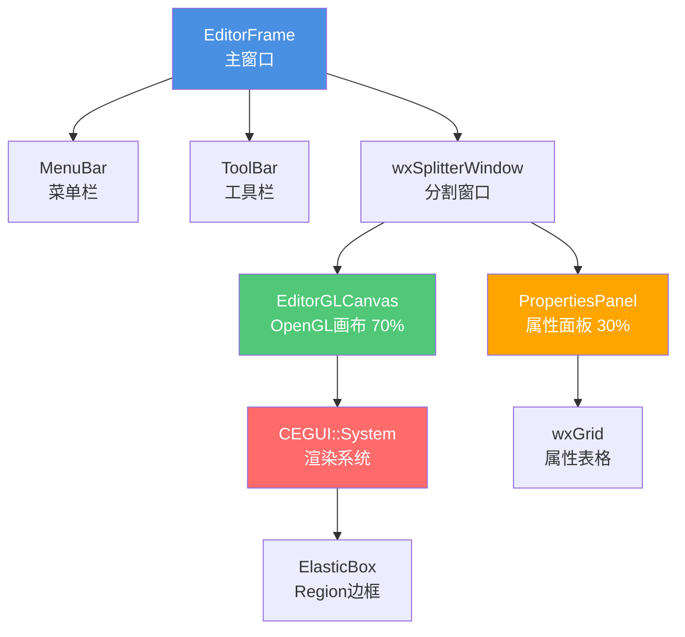
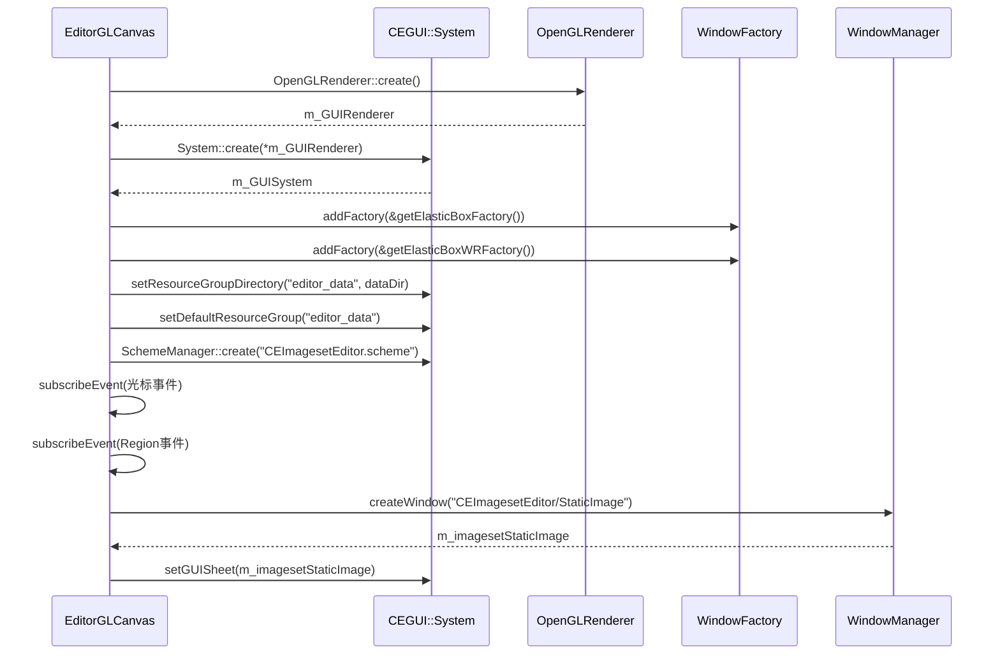
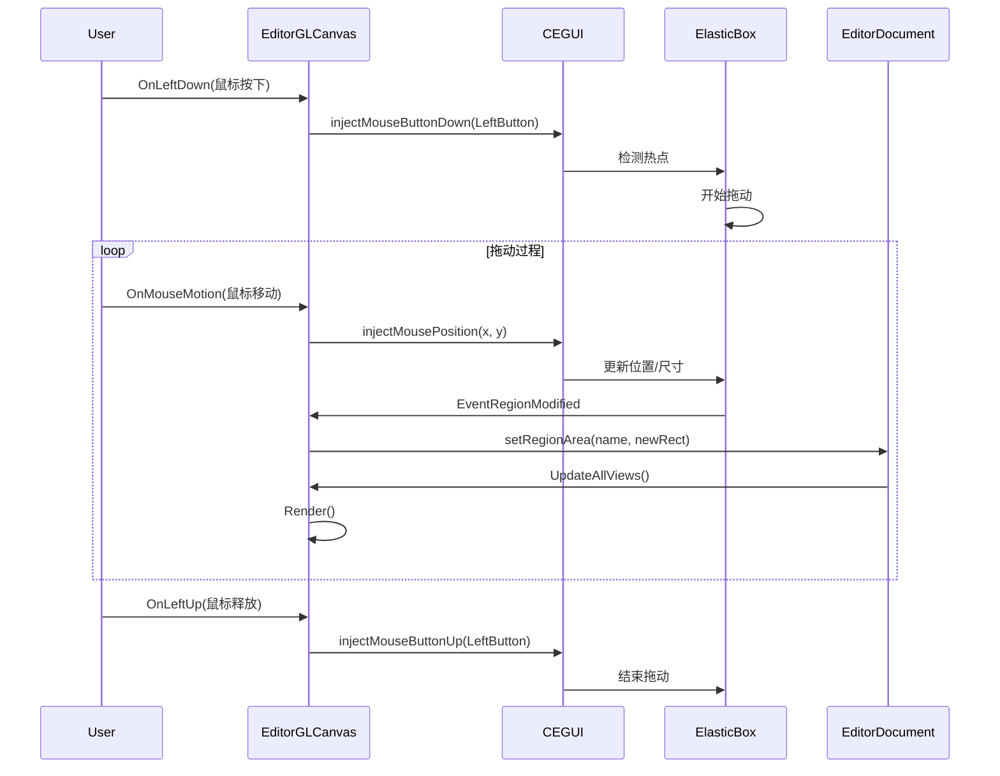

# 用户界面架构 (UI Architecture)

## 概述 (Overview)

CEImagesetEditor 的用户界面采用经典的**分割窗口布局**,结合 **wxWidgets** 的 GUI 组件和 **CEGUI** 的 OpenGL 渲染。整个 UI 架构分为三个主要层次:

1. **容器层**: `EditorFrame` - 主窗口框架
2. **交互层**: `EditorGLCanvas` + `PropertiesPanel` - 用户交互组件
3. **渲染层**: CEGUI + OpenGL - 图形渲染



---

## 布局概览 (Layout Overview)

### 主界面组成

```
┌─────────────────────────────────────────────────────────────┐
│ CEImagesetEditor - MyImageset.imageset                      │ ← 标题栏
├─────────────────────────────────────────────────────────────┤
│ File  Edit  View  Help                                      │ ← 菜单栏
├─────────────────────────────────────────────────────────────┤
│ [New] [Open] [Save] | [Add] [Del] | [Zoom+] [Zoom-]        │ ← 工具栏
├──────────────────────────────────┬──────────────────────────┤
│                                  │ Imageset Properties      │
│                                  ├──────────────────────────┤
│                                  │ Name: [MyImageset     ]  │
│                                  │ Image: [texture.png   ]  │
│                                  │ Native Res: [640x480▼]   │
│                                  │ Auto Scaled: [✓]         │
│                                  ├──────────────────────────┤
│                                  │ Image Regions            │
│                                  ├──────┬────┬────┬────┬────┤
│         EditorGLCanvas           │ Name │ X  │ Y  │ W  │ H  │
│                                  ├──────┼────┼────┼────┼────┤
│    ┌──────────────────┐          │Button│ 0  │ 0  │100 │ 30 │
│    │ ┌──────────┐     │          │Icon  │100 │ 0  │ 32 │ 32 │
│    │ │  Button  │     │          │Panel │ 0  │ 30 │200 │100 │
│    │ └──────────┘     │          │      │    │    │    │    │
│    │  ┌───┐           │          │      │    │    │    │    │
│    │  │Icon           │          │      │    │    │    │    │
│    │  └───┘           │          │      │    │    │    │    │
│    │                  │          │      │    │    │    │    │
│    └──────────────────┘          │      │    │    │    │    │
│                                  │      │    │    │    │    │
│                                  │      │    │    │    │    │
│                                  │      │    │    │    │    │
│                                  │ PropertiesPanel          │
├──────────────────────────────────┴──────────────────────────┤
│ Mouse: (125, 67) | Zoom: 100% | Size: 512x512               │ ← 状态栏
└─────────────────────────────────────────────────────────────┘
```

---

## 关键类 (Key Classes)

### 1. EditorFrame (主窗口)

#### 类定义

```cpp
class EditorFrame : public wxDocParentFrame {
    DECLARE_CLASS(EditorFrame)
    
public:
    EditorFrame(wxDocManager* manager, wxFrame* frame, 
               wxWindowID id, const wxString& title, 
               const wxPoint& pos, const wxSize& size, 
               const long type);
    ~EditorFrame();
    
    void SetDocument(EditorDocument* document);
    EditorGLCanvas* AttachCanvas(EditorView* view);
    EditorGLCanvas* getCanvas() { return m_glcanvasImageset; }
    PropertiesPanel* getPropsPanel() { return m_propsPanel; }
    
private:
    EditorDocument* m_document;
    wxSplitterWindow* m_splitter;
    PropertiesPanel* m_propsPanel;
    EditorGLCanvas* m_glcanvasImageset;
    DialogResourceGroups* m_resGrpsEditor;
    wxColour m_backgroundColour;
    wxMenu* m_EditMenu;
    
    void AttachMenubar();
    void AttachToolbar();
    void createContent();
    bool Close(bool force = FALSE);
    
    // 事件处理
    void OnPaint(wxPaintEvent& event);
    void OnChangeBackgroundColour(wxCommandEvent& event);
    void OnEditResourceGroups(wxCommandEvent& event);
    
    DECLARE_EVENT_TABLE()
};
```

#### 菜单结构

```cpp
void EditorFrame::AttachMenubar() {
    wxMenuBar* menuBar = new wxMenuBar;
    
    // File 菜单
    wxMenu* fileMenu = new wxMenu;
    fileMenu->Append(wxID_NEW, "&New\tCtrl+N");
    fileMenu->Append(wxID_OPEN, "&Open...\tCtrl+O");
    fileMenu->Append(wxID_SAVE, "&Save\tCtrl+S");
    fileMenu->Append(wxID_SAVEAS, "Save &As...");
    fileMenu->AppendSeparator();
    fileMenu->Append(wxID_EXIT, "E&xit\tAlt+F4");
    
    // Edit 菜单
    wxMenu* editMenu = new wxMenu;
    editMenu->Append(ID_ADD_REGION, "&Add Region\tCtrl+A");
    editMenu->Append(ID_DELETE_REGION, "&Delete Region\tDel");
    editMenu->AppendSeparator();
    editMenu->Append(wxID_UNDO, "&Undo\tCtrl+Z");
    editMenu->Append(wxID_REDO, "&Redo\tCtrl+Y");
    
    // View 菜单
    wxMenu* viewMenu = new wxMenu;
    viewMenu->Append(ID_CHANGE_BG_COLOUR, "Background &Colour...");
    viewMenu->Append(ID_EDIT_RES_GROUPS, "&Resource Groups...");
    viewMenu->AppendSeparator();
    viewMenu->Append(ID_ZOOM_IN, "Zoom &In\tCtrl++");
    viewMenu->Append(ID_ZOOM_OUT, "Zoom &Out\tCtrl+-");
    viewMenu->Append(ID_ZOOM_RESET, "Zoom &Reset\tCtrl+0");
    
    // Help 菜单
    wxMenu* helpMenu = new wxMenu;
    helpMenu->Append(wxID_ABOUT, "&About...");
    
    menuBar->Append(fileMenu, "&File");
    menuBar->Append(editMenu, "&Edit");
    menuBar->Append(viewMenu, "&View");
    menuBar->Append(helpMenu, "&Help");
    
    SetMenuBar(menuBar);
}
```

#### 布局创建

```cpp
void EditorFrame::createContent() {
    // 创建分割窗口
    m_splitter = new wxSplitterWindow(this, wxID_ANY, 
                                      wxDefaultPosition, wxDefaultSize,
                                      wxSP_3D | wxSP_LIVE_UPDATE);
    
    // 创建属性面板(右侧 30%)
    m_propsPanel = new PropertiesPanel(m_splitter, 
                                       wxDefaultPosition, 
                                       wxSize(250, -1));
    
    // 创建 OpenGL 画布(左侧 70%)
    // 注意: Canvas 在 AttachCanvas() 中创建
    
    // 设置分割比例
    m_splitter->SetMinimumPaneSize(200);
    m_splitter->SetSashGravity(0.7);  // 70% 给左侧
}
```

---

### 2. EditorGLCanvas (OpenGL 渲染画布)

#### 类定义

```cpp
class EditorGLCanvas : public wxGLCanvas {
public:
    EditorGLCanvas(EditorView* view, wxWindow* parent, 
                  const wxPoint& pos = wxDefaultPosition, 
                  const wxSize& size = wxDefaultSize);
    ~EditorGLCanvas();
    
    // 视口管理
    void changeSize(int newWidth, int newHeight);
    void setBackgroundColour(const wxColour& colour);
    
    // 图片管理
    void setImage(const wxString& name);
    
    // Region 管理
    void selectRegion(const wxString& name);
    void renameRegion(const wxString& currentname, const wxString& newname);
    void addRegion(const wxString& name, const wxRect& dim);
    void setRegionArea(const wxString& name, const wxRect& dim);
    void deleteRegion(const wxString& name);
    void deleteAllRegions();
    
    // 缩放控制
    void computeZoomFactor(int MouseWheelDirection);
    
    // 渲染
    void Render();
    bool Reset();
    
private:
    EditorView* m_view;
    CEGUI::System* m_GUISystem;
    CEGUI::OpenGLRenderer* m_GUIRenderer;
    CEGUI::Window* m_imagesetStaticImage;
    
    bool m_useBigSteps;
    wxPoint m_dragPoint;
    float m_zoomFactor;
    float m_realWidth, m_realHeight;
    long m_lastMouseX, m_lastMouseY;
    
    // 滚动条状态
    int m_scrollPosX, m_scrollDocX, m_scrollPageX;
    int m_scrollPosY, m_scrollDocY, m_scrollPageY;
    
    // CEGUI 管理
    void initialiseCEGUI();
    void cleanupCEGUI();
    bool resetCEGUI();
    void createCEGUIWindows();
    void renderImageset();
    
    // 滚动条管理
    void updateScrollbars();
    void updateImageScrollPosition();
    
    // 光标处理
    bool handleRegionNorthSouthCursor(const CEGUI::EventArgs& e);
    bool handleRegionEastWestCursor(const CEGUI::EventArgs& e);
    bool handleRegionNorthEastSouthWestCursor(const CEGUI::EventArgs& e);
    bool handleRegionNorthWestSouthEastCursor(const CEGUI::EventArgs& e);
    bool handleRegionMoveCursor(const CEGUI::EventArgs& e);
    bool handleRegionNormalCursor(const CEGUI::EventArgs& e);
    
    // Region 事件处理
    bool handleRegionMouseEnter(const CEGUI::EventArgs& e);
    bool handleRegionMouseLeave(const CEGUI::EventArgs& e);
    bool handleRegionActivated(const CEGUI::EventArgs& e);
    bool handleRegionDeactivated(const CEGUI::EventArgs& e);
    bool handleRegionModified(const CEGUI::EventArgs& e);
    
    // wxWidgets 事件处理
    void OnResize(wxSizeEvent& event);
    void OnPaint(wxPaintEvent& event);
    void OnErase(wxEraseEvent& event);
    void OnMouseMotion(wxMouseEvent& event);
    void OnLeftDown(wxMouseEvent& event);
    void OnLeftUp(wxMouseEvent& event);
    void OnRightDown(wxMouseEvent& event);
    void OnRightUp(wxMouseEvent& event);
    void OnMiddleDown(wxMouseEvent& event);
    void OnMouseWheel(wxMouseEvent& event);
    void OnKeyDown(wxKeyEvent& event);
    void OnKeyUp(wxKeyEvent& event);
    void OnScrollWin(wxScrollWinEvent& event);
    
    DECLARE_EVENT_TABLE()
};
```

#### CEGUI 初始化流程



#### 初始化代码详解

```cpp
void EditorGLCanvas::initialiseCEGUI() {
    // 1. 创建 OpenGL 渲染器和 CEGUI 系统
    m_GUIRenderer = &OpenGLRenderer::create();
    m_GUISystem = &System::create(*m_GUIRenderer);
    
    // 2. 设置日志级别
    #if defined(DEBUG) || defined(_DEBUG)
        Logger::getSingleton().setLoggingLevel(Informative);
    #else
        Logger::getSingleton().setLoggingLevel(Errors);
    #endif
    
    // 3. 注册自定义窗口类型
    WindowFactoryManager::getSingleton().addFactory(&getElasticBoxFactory());
    WindowRendererManager::getSingleton().addFactory(&getElasticBoxWRFactory());
    
    // 4. 配置资源路径
    DefaultResourceProvider* rp = static_cast<DefaultResourceProvider*>(
        m_GUISystem->getResourceProvider());
    
    String dataDir(CEGUIHelper::ToCEGUIString(
        wxStandardPaths::Get().GetResourcesDir()));
    if (!dataDir.empty() && (dataDir[dataDir.length() - 1] != '/'))
        dataDir += '/';
    
    #if defined(__WIN32__) || defined(_WIN32)
        dataDir += "data/";
    #endif
    
    rp->setResourceGroupDirectory("editor_data", dataDir);
    rp->setDefaultResourceGroup("editor_data");
    
    // 5. 加载编辑器 Scheme
    SchemeManager::getSingleton().create("CEImagesetEditor.scheme");
    
    // 6. 订阅全局事件
    GlobalEventSet& ges = CEGUI::GlobalEventSet::getSingleton();
    
    // 光标形状事件
    ges.subscribeEvent("ElasticBox/SetNorthSouthCursor",
        Event::Subscriber(&EditorGLCanvas::handleRegionNorthSouthCursor, this));
    ges.subscribeEvent("ElasticBox/SetEastWestCursor",
        Event::Subscriber(&EditorGLCanvas::handleRegionEastWestCursor, this));
    ges.subscribeEvent("ElasticBox/SetNorthEastSouthWestCursor",
        Event::Subscriber(&EditorGLCanvas::handleRegionNorthEastSouthWestCursor, this));
    ges.subscribeEvent("ElasticBox/SetNorthWestSouthEastCursor",
        Event::Subscriber(&EditorGLCanvas::handleRegionNorthWestSouthEastCursor, this));
    ges.subscribeEvent("ElasticBox/SetMoveCursor",
        Event::Subscriber(&EditorGLCanvas::handleRegionMoveCursor, this));
    ges.subscribeEvent("ElasticBox/SetNormalCursor",
        Event::Subscriber(&EditorGLCanvas::handleRegionNormalCursor, this));
    
    // Region 修改事件(全局订阅,可静音)
    ges.subscribeEvent("Window/Moved",
        CEGUI::Event::Subscriber(&EditorGLCanvas::handleRegionModified, this));
    ges.subscribeEvent("Window/Sized",
        CEGUI::Event::Subscriber(&EditorGLCanvas::handleRegionModified, this));
    
    // 7. 重置资源组(避免污染用户文件加载)
    rp->setDefaultResourceGroup("");
    
    // 8. 创建 CEGUI 窗口
    createCEGUIWindows();
    
    // 9. 重置到初始状态
    resetCEGUI();
}
```

#### 渲染管线


#### 渲染代码

```cpp
void EditorGLCanvas::Render() {
    SetCurrent();
    
    // 清除颜色缓冲区
    glClear(GL_COLOR_BUFFER_BIT);
    
    // CEGUI 渲染
    renderImageset();
    
    glFlush();
    SwapBuffers();
}

void EditorGLCanvas::renderImageset() {
    if (CEGUI::System::getSingletonPtr())
        CEGUI::System::getSingleton().renderGUI();
}
```

#### 缩放功能

```cpp
void EditorGLCanvas::computeZoomFactor(int MouseWheelDirection) {
    // 调整缩放因子
    if (MouseWheelDirection > 0)
        m_zoomFactor += 0.125;  // 放大 12.5%
    else if (MouseWheelDirection < 0)
        m_zoomFactor -= 0.125;  // 缩小 12.5%
    
    // 限制缩放范围: 25% - 1000%
    if (m_zoomFactor < 0.25)
        m_zoomFactor = 0.25;
    if (m_zoomFactor > 10.0)
        m_zoomFactor = 10.0;
    
    float width = m_zoomFactor * m_realWidth;
    float height = m_zoomFactor * m_realHeight;
    
    // 静音事件(避免大量不必要的通知)
    CEGUI::GlobalEventSet::getSingleton().setMutedState(true);
    
    // 更新主图片尺寸
    m_imagesetStaticImage->setSize(
        UVector2(cegui_absdim(width), cegui_absdim(height)));
    
    // 更新所有 Region 的缩放
    for (size_t i = 0; i < m_imagesetStaticImage->getChildCount(); ++i) {
        CEGUI::Window* wnd = m_imagesetStaticImage->getChildAtIdx(i);
        
        if (wnd->testClassName("ElasticBox")) {
            float old_zoom = static_cast<ElasticBox*>(wnd)->getScaleSnap();
            static_cast<ElasticBox*>(wnd)->setScaleSnap(m_zoomFactor);
            
            URect area(wnd->getArea());
            // 取消旧缩放
            area.d_min.d_x.d_offset /= old_zoom;
            area.d_min.d_y.d_offset /= old_zoom;
            area.d_max.d_x.d_offset /= old_zoom;
            area.d_max.d_y.d_offset /= old_zoom;
            // 应用新缩放
            area.d_min.d_x.d_offset *= m_zoomFactor;
            area.d_min.d_y.d_offset *= m_zoomFactor;
            area.d_max.d_x.d_offset *= m_zoomFactor;
            area.d_max.d_y.d_offset *= m_zoomFactor;
            // 更新窗口区域
            wnd->setArea(area);
        }
    }
    
    // 恢复事件
    CEGUI::GlobalEventSet::getSingleton().setMutedState(false);
    
    updateScrollbars();
    GetMainFrame()->Refresh();
}
```

---

### 3. PropertiesPanel (属性面板)

#### 类定义

```cpp
class PropertiesPanel : public wxPanel {
public:
    PropertiesPanel(wxWindow* parent, const wxPoint& pos, const wxSize& size);
    
    void setView(EditorView* aView);
    void createContent();
    void reset();
    
    // GUI 事件处理
    void onBrowseImageFile(wxCommandEvent& event);
    void onChangeImagesetName(wxCommandEvent& event);
    void onChangeImageFilename(wxCommandEvent& event);
    void onChangeNativeResolution(wxCommandEvent& event);
    void onChangeAutoScaled(wxCommandEvent& event);
    void onGridAddRow(wxCommandEvent& event);
    void onGridDelRow(wxCommandEvent& event);
    void onGridCellChange(wxGridEvent& event);
    void onGridCellEdit(wxGridEvent& event);
    void onGridCellSelect(wxGridEvent& event);
    
    // 访问器和修改器
    wxString getImagesetName() const;
    void setImagesetName(const wxString& name);
    wxString getImageFilename() const;
    void setImageFilename(const wxString& name);
    wxPoint getNativeResolution() const;
    void setNativeResolution(const wxPoint& NativeResolution);
    bool getAutoScaled() const;
    void setAutoScaled(const bool AutoScaled);
    
    // Region 管理
    void addRegion(const wxString& name, const wxRect& dim, int rowindex = -1);
    int deleteRegion(const wxString& name);
    void deleteAllRegions();
    int selectRegion(const wxString& name);
    wxString getSelectedRegion() const;
    void setRegionArea(const wxString& name, const wxRect& dim);
    wxRect getRegionArea(const wxString& name) const;
    void renameRegion(const wxString& currentname, const wxString& newname);
    
private:
    EditorView* m_view;
    wxTextCtrl* m_imagesetNameTextCtrl;
    wxTextCtrl* m_imageFilenameTextCtrl;
    wxButton* m_imageFilenameBrowseButton;
    wxComboBox* m_nativeResolutionComboBox;
    wxCheckBox* m_autoScaleCheckbox;
    wxGrid* m_propertiesGrid;
    size_t m_imageGUID;
    wxString m_oldRowName;
    
    bool isDocumentValid() const;
    EditorDocument* getDocument() const;
    wxString getUniqueImageName();
    void createPropertiesGrid(wxWindow* parent);
    int getInternalRegionIndex(const wxString& name) const;
    wxString getDefaultResourceGroupRelativePath(const wxString& filename) const;
    
    DECLARE_EVENT_TABLE()
};
```

#### 面板布局

```cpp
void PropertiesPanel::createContent() {
    wxBoxSizer* mainSizer = new wxBoxSizer(wxVERTICAL);
    
    // === Imageset 属性区域 ===
    wxStaticBoxSizer* imagesetBox = new wxStaticBoxSizer(
        wxVERTICAL, this, "Imageset Properties");
    
    // Imageset 名称
    wxBoxSizer* nameSizer = new wxBoxSizer(wxHORIZONTAL);
    nameSizer->Add(new wxStaticText(this, wxID_ANY, "Name:"), 
                   0, wxALIGN_CENTER_VERTICAL | wxRIGHT, 5);
    m_imagesetNameTextCtrl = new wxTextCtrl(this, ID_IMAGESET_NAME);
    nameSizer->Add(m_imagesetNameTextCtrl, 1, wxEXPAND);
    imagesetBox->Add(nameSizer, 0, wxEXPAND | wxALL, 5);
    
    // 图片文件
    wxBoxSizer* fileSizer = new wxBoxSizer(wxHORIZONTAL);
    fileSizer->Add(new wxStaticText(this, wxID_ANY, "Image:"), 
                   0, wxALIGN_CENTER_VERTICAL | wxRIGHT, 5);
    m_imageFilenameTextCtrl = new wxTextCtrl(this, ID_IMAGE_FILENAME);
    fileSizer->Add(m_imageFilenameTextCtrl, 1, wxEXPAND);
    m_imageFilenameBrowseButton = new wxButton(this, ID_BROWSE_IMAGE, "...", 
                                               wxDefaultPosition, wxSize(30, -1));
    fileSizer->Add(m_imageFilenameBrowseButton, 0, wxLEFT, 5);
    imagesetBox->Add(fileSizer, 0, wxEXPAND | wxALL, 5);
    
    // 原生分辨率
    wxBoxSizer* resSizer = new wxBoxSizer(wxHORIZONTAL);
    resSizer->Add(new wxStaticText(this, wxID_ANY, "Native Res:"), 
                  0, wxALIGN_CENTER_VERTICAL | wxRIGHT, 5);
    m_nativeResolutionComboBox = new wxComboBox(this, ID_NATIVE_RES, 
                                                "640x480", wxDefaultPosition, 
                                                wxDefaultSize, 0, NULL, 
                                                wxCB_DROPDOWN);
    m_nativeResolutionComboBox->Append("640x480");
    m_nativeResolutionComboBox->Append("800x600");
    m_nativeResolutionComboBox->Append("1024x768");
    m_nativeResolutionComboBox->Append("1280x720");
    m_nativeResolutionComboBox->Append("1920x1080");
    resSizer->Add(m_nativeResolutionComboBox, 1, wxEXPAND);
    imagesetBox->Add(resSizer, 0, wxEXPAND | wxALL, 5);
    
    // 自动缩放
    m_autoScaleCheckbox = new wxCheckBox(this, ID_AUTO_SCALED, "Auto Scaled");
    imagesetBox->Add(m_autoScaleCheckbox, 0, wxALL, 5);
    
    mainSizer->Add(imagesetBox, 0, wxEXPAND | wxALL, 5);
    
    // === Region 列表区域 ===
    wxStaticBoxSizer* regionsBox = new wxStaticBoxSizer(
        wxVERTICAL, this, "Image Regions");
    
    // 创建网格
    createPropertiesGrid(this);
    regionsBox->Add(m_propertiesGrid, 1, wxEXPAND | wxALL, 5);
    
    // 添加/删除按钮
    wxBoxSizer* buttonSizer = new wxBoxSizer(wxHORIZONTAL);
    wxButton* addButton = new wxButton(this, ID_ADD_ROW, "Add");
    wxButton* delButton = new wxButton(this, ID_DEL_ROW, "Delete");
    buttonSizer->Add(addButton, 0, wxRIGHT, 5);
    buttonSizer->Add(delButton, 0);
    regionsBox->Add(buttonSizer, 0, wxALIGN_RIGHT | wxALL, 5);
    
    mainSizer->Add(regionsBox, 1, wxEXPAND | wxALL, 5);
    
    SetSizer(mainSizer);
}
```

#### wxGrid 配置

```cpp
void PropertiesPanel::createPropertiesGrid(wxWindow* parent) {
    m_propertiesGrid = new wxGrid(parent, ID_PROPERTIES_GRID);
    
    // 创建 5 列: Name, X, Y, Width, Height
    m_propertiesGrid->CreateGrid(0, 5);
    m_propertiesGrid->SetColLabelValue(0, "Name");
    m_propertiesGrid->SetColLabelValue(1, "X");
    m_propertiesGrid->SetColLabelValue(2, "Y");
    m_propertiesGrid->SetColLabelValue(3, "Width");
    m_propertiesGrid->SetColLabelValue(4, "Height");
    
    // 设置列宽
    m_propertiesGrid->SetColSize(0, 120);  // Name 列较宽
    m_propertiesGrid->SetColSize(1, 60);
    m_propertiesGrid->SetColSize(2, 60);
    m_propertiesGrid->SetColSize(3, 60);
    m_propertiesGrid->SetColSize(4, 60);
    
    // 禁用行标签
    m_propertiesGrid->SetRowLabelSize(0);
    
    // 启用网格线
    m_propertiesGrid->EnableGridLines(true);
    
    // 设置选择模式为单行
    m_propertiesGrid->SetSelectionMode(wxGrid::wxGridSelectRows);
}
```

---

## 鼠标交互流程 (Mouse Interaction)

### 拖动 Region



### 光标形状管理

```cpp
bool EditorGLCanvas::handleRegionNorthSouthCursor(const CEGUI::EventArgs& e) {
    SetCursor(wxCURSOR_SIZENS);  // ↕ 光标
    return true;
}

bool EditorGLCanvas::handleRegionEastWestCursor(const CEGUI::EventArgs& e) {
    SetCursor(wxCURSOR_SIZEWE);  // ↔ 光标
    return true;
}

bool EditorGLCanvas::handleRegionNorthEastSouthWestCursor(const CEGUI::EventArgs& e) {
    SetCursor(wxCURSOR_SIZENESW);  // ↗↙ 光标
    return true;
}

bool EditorGLCanvas::handleRegionNorthWestSouthEastCursor(const CEGUI::EventArgs& e) {
    SetCursor(wxCURSOR_SIZENWSE);  // ↖↘ 光标
    return true;
}

bool EditorGLCanvas::handleRegionMoveCursor(const CEGUI::EventArgs& e) {
    SetCursor(wxCURSOR_SIZING);  // ✥ 移动光标
    return true;
}

bool EditorGLCanvas::handleRegionNormalCursor(const CEGUI::EventArgs& e) {
    SetCursor(wxCURSOR_CROSS);  // + 十字光标
    return true;
}
```

---

## 键盘快捷键 (Keyboard Shortcuts)

| 快捷键 | 功能 |
|--------|------|
| `Ctrl+N` | 新建 Imageset |
| `Ctrl+O` | 打开文件 |
| `Ctrl+S` | 保存文件 |
| `Ctrl+A` | 添加 Region |
| `Del` | 删除选中的 Region |
| `Ctrl+Z` | 撤销(未实现) |
| `Ctrl+Y` | 重做(未实现) |
| `Ctrl++` | 放大 |
| `Ctrl+-` | 缩小 |
| `Ctrl+0` | 重置缩放 |
| `鼠标滚轮` | 缩放 |
| `中键拖动` | 平移视图 |

---

## 滚动条管理

### 更新滚动条

```cpp
void EditorGLCanvas::updateScrollbars() {
    // 更新内部跟踪信息
    GetClientSize(&m_scrollPageX, &m_scrollPageY);
    m_scrollDocX = static_cast<int>(m_realWidth * m_zoomFactor);
    m_scrollDocY = static_cast<int>(m_realHeight * m_zoomFactor);
    
    // 限制滚动位置
    if (m_scrollPosX < 0)
        m_scrollPosX = 0;
    if (m_scrollPosX > (m_scrollDocX - m_scrollPageX))
        m_scrollPosX = m_scrollDocX - m_scrollPageX;
    
    if (m_scrollPosY < 0)
        m_scrollPosY = 0;
    if (m_scrollPosY > (m_scrollDocY - m_scrollPageY))
        m_scrollPosY = m_scrollDocY - m_scrollPageY;
    
    // 设置滚动条
    SetScrollbar(wxHORIZONTAL, m_scrollPosX, m_scrollPageX, m_scrollDocX);
    SetScrollbar(wxVERTICAL, m_scrollPosY, m_scrollPageY, m_scrollDocY);
}
```

### 更新图片滚动位置

```cpp
void EditorGLCanvas::updateImageScrollPosition() {
    if (m_imagesetStaticImage) {
        m_imagesetStaticImage->setPosition(
            UVector2(UDim(0, -static_cast<float>(m_scrollPosX)),
                    UDim(0, -static_cast<float>(m_scrollPosY))));
        Render();
    }
}
```

---

## 自定义单元格编辑器 (wxPathCellEditor)

### 用途

`wxPathCellEditor` 是为 `PropertiesPanel` 的图片文件名列定制的单元格编辑器,提供文本框 + 浏览按钮的组合控件。

### 实现

```cpp
class wxPathCellEditor : public wxGridCellEditor {
public:
    wxPathCellEditor();
    
    void Create(wxWindow* parent, wxWindowID id, wxEvtHandler* evtHandler);
    void SetSize(const wxRect& rect);
    void BeginEdit(int row, int col, wxGrid* grid);
    bool EndEdit(int row, int col, wxGrid* grid);
    void Reset();
    wxString GetValue();
    
private:
    wxPanel* m_panel;
    wxTextCtrl* m_textCtrl;
    wxButton* m_browseButton;
    wxString m_startValue;
    
    void OnBrowseButtonClick(wxCommandEvent& event);
    void DoBeginEdit(const wxString& startValue);
    void DoReset(const wxString& startValue);
};
```

---

## 下一步

- 查看 [核心模块](02_核心核心模块_Core_Modules.md) 了解 EditorView 的完整 API
- 查看 [工作流程与事件处理](07_工作流程与事件处理_Workflows_and_Events.md) 了解事件流
- 查看 [详细类参考](06_详细类参考_Detailed_Class_Reference.md) 了解 ElasticBox 的实现
