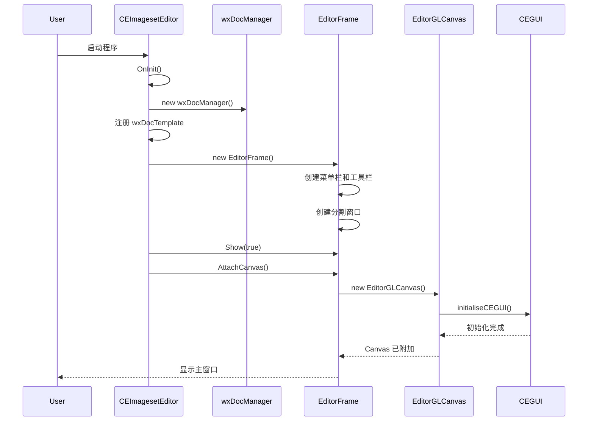
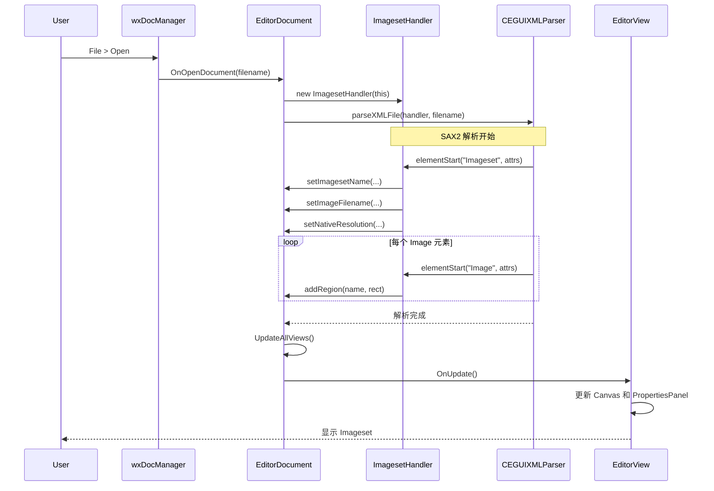
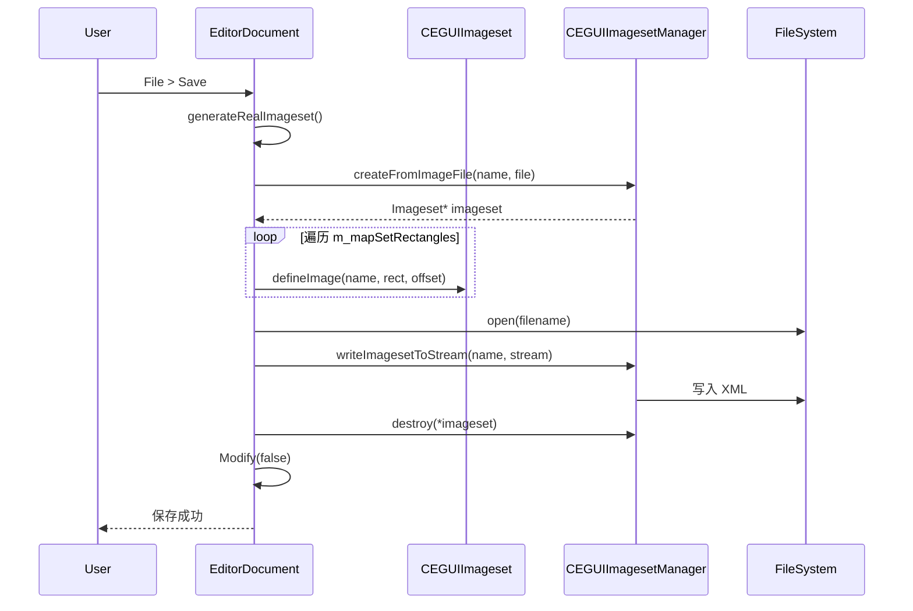
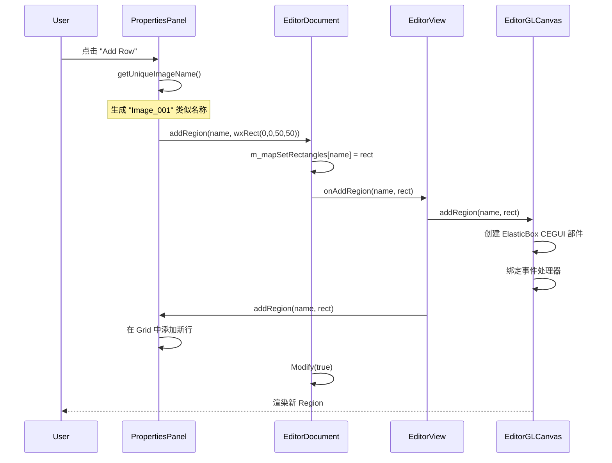
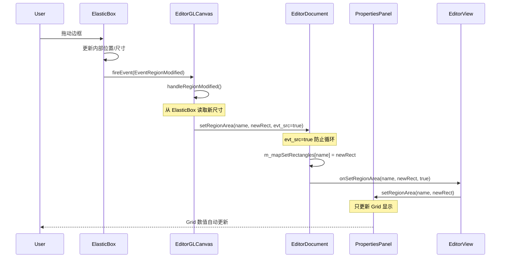
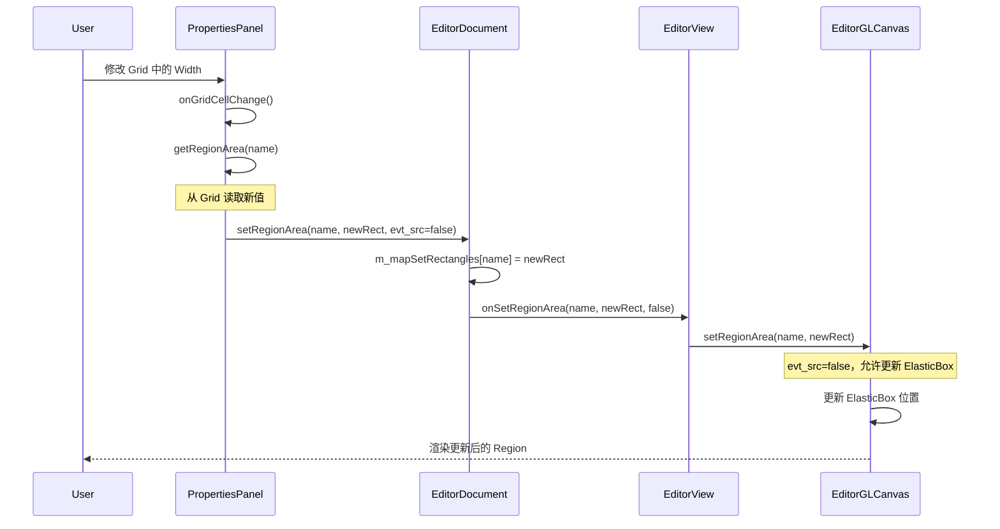

# 工作流程与事件处理 (Workflows and Event Handling)

## 应用程序启动流程 (Application Startup Flow)



### 关键步骤说明

1. **文档模板注册**: 将 `.xml` 和 `.imageset` 文件关联到 `EditorDocument` 和 `EditorView`
2. **最大文档数限制**: `SetMaxDocsOpen(1)` 确保单文档界面（SDI）
3. **延迟 Canvas 创建**: 必须在窗口显示后才能初始化 OpenGL 上下文

---

## 打开文件流程 (Open File Workflow)



### ImagesetHandler 的角色

`ImagesetHandler` 是一个 **SAX2 事件处理器**，它实现了 `CEGUI::XMLHandler` 接口：

- **elementStart()**: 当识别到 XML 标签时被调用
  - `<Imageset>`: 提取 Name, Imagefile, NativeRes 等属性
  - `<Image>`: 提取 Name, XPos, YPos, Width, Height 并调用 `EditorDocument::addRegion()`
- **elementEnd()**: 标签结束时的清理工作

### 错误处理

- XML 解析错误会抛出 `CEGUI::Exception`
- 在 `OnOpenDocument()` 中捕获并记录到 Logger
- 用户会看到错误对话框

---

## 保存文件流程 (Save File Workflow)



### 为什么需要临时 Imageset？

CEGUI 的 `ImagesetManager::writeImagesetToStream()` 方法需要一个真实的 `Imageset` 对象。  
`EditorDocument` 只存储原始数据（字符串和矩形），因此需要：
1. 从原始数据构造临时 Imageset
2. 让 CEGUI 序列化这个 Imageset 到 XML
3. 立即销毁临时 Imageset

---

## 添加 Region 流程 (Add Region Workflow)



### ElasticBox 事件绑定

当创建 ElasticBox 时，Canvas 会订阅以下事件：
- `EventRegionModified`: 调用 `handleRegionModified()` 同步尺寸到 Document
- `EventRegionActivated`: 调用 `handleRegionActivated()` 更新选中状态
- `EventMouseEnter`: 改变光标形状（如调整大小光标）

---

## 编辑 Region 的双向同步 (Bidirectional Region Editing)

### 场景 1: 用户在 Canvas 中拖动 Region



### 场景 2: 用户在 PropertiesPanel 中修改数值



### 防止无限递归的机制

`evt_src` 参数的作用：
- **true**: 事件源是 Canvas，不要再更新 ElasticBox（避免循环）
- **false**: 事件源是 PropertiesPanel，需要更新 ElasticBox

---

## 事件处理架构 (Event Handling Architecture)

### wxWidgets 事件流

```
用户操作
    ↓
wxEvent (wxMouseEvent, wxKeyEvent, etc.)
    ↓
EditorGLCanvas::OnXXX() 或 PropertiesPanel::onXXX()
    ↓
EditorDocument::setXXX() 或 addRegion()
    ↓
wxDocument::Modify(true) + UpdateAllViews()
    ↓
EditorView::OnUpdate()
    ↓
EditorGLCanvas 和 PropertiesPanel 的更新方法
    ↓
UI 刷新
```

### CEGUI 事件流

```
用户操作 (在 ElasticBox 上)
    ↓
CEGUI::Event (EventRegionModified, EventMouseEnter, etc.)
    ↓
EditorGLCanvas::handleRegionXXX()
    ↓
EditorDocument::setRegionArea()
    ↓
(同 wxWidgets 事件流)
```

### 事件订阅代码示例

```cpp
// 在 EditorGLCanvas::createCEGUIWindows() 中
elasticBox->subscribeEvent(
    ElasticBox::EventRegionModified,
    CEGUI::Event::Subscriber(&EditorGLCanvas::handleRegionModified, this)
);
```

---

## 渲染循环 (Rendering Loop)

### 触发渲染的时机

1. **窗口重绘**: `OnPaint(wxPaintEvent&)`
2. **数据变化**: `EditorView::OnUpdate()` 调用 `Canvas->Render()`
3. **交互操作**: 鼠标/键盘事件后调用 `Render()`

### 渲染步骤

```cpp
void EditorGLCanvas::Render() {
    // 1. 设置 OpenGL 上下文
    SetCurrent();
    
    // 2. 清空缓冲区
    glClear(GL_COLOR_BUFFER_BIT);
    
    // 3. 渲染背景图片
    renderImageset();
    
    // 4. CEGUI 渲染所有窗口部件（包括 ElasticBox）
    CEGUI::System::getSingleton().renderGUI();
    
    // 5. 交换前后缓冲区
    SwapBuffers();
}
```

### 双缓冲机制

使用 OpenGL 的双缓冲避免闪烁：
- 后台缓冲区绘制
- 前台缓冲区显示
- `SwapBuffers()` 交换两者

