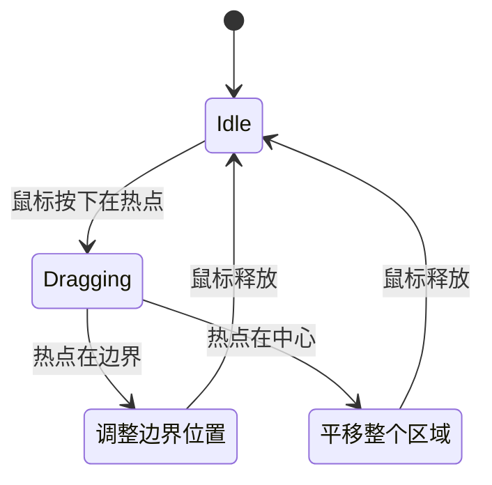

# 高级主题与扩展 (Advanced Topics and Extensions)

## ElasticBox 实现深度解析 (ElasticBox Deep Dive)

### 设计动机

标准 CEGUI 不提供可拖动、可调整大小的边框部件。`ElasticBox` 是一个自定义 CEGUI 窗口类型，专为 Imageset 编辑器设计。

### 核心特性

#### 1. 拖动热点系统

ElasticBox 定义了 8 个热点区域：

```
┌─────────────┐
│  TopLeft    │  Top     │  TopRight
├─────────────┤
│  Left       │          │  Right
├─────────────┤
│  BottomLeft │  Bottom  │  BottomRight
└─────────────┘
```

**实现原理**:
- 每个热点是 CEGUI::Rect 定义的小区域（通常 5-10 像素）
- 鼠标移动时检测光标位于哪个热点
- 根据热点改变光标形状（`CEGUI::MouseCursor`）

#### 2. 光标形状映射

| 热点 | 光标形状 | CEGUI 事件 |
|---|---|---|
| TopLeft/BottomRight | NW-SE 调整大小 | EventNorthWestSouthEastCursor |
| TopRight/BottomLeft | NE-SW 调整大小 | EventNorthEastSouthWestCursor |
| Top/Bottom | N-S 调整大小 | EventNorthSouthCursor |
| Left/Right | E-W 调整大小 | EventEastWestCursor |
| 中心区域 | 移动光标 | EventMoveCursor |

#### 3. 拖动状态机



### 自定义属性

定义在 `ElasticBoxProperties.h`:

```cpp
class ElasticBoxPropertyMinimumSize : public CEGUI::Property
{
public:
    String get(const PropertyReceiver* receiver) const;
    void set(PropertyReceiver* receiver, const String& value);
};
```

**可配置属性**:
- `MinimumSize`: 最小尺寸限制（防止拖到 0x0）
- `MaximumSize`: 最大尺寸限制
- `SnapToGrid`: 是否对齐网格
- `GridSize`: 网格大小

### 工厂类注册

```cpp
ElasticBoxFactory& getElasticBoxFactory() {
    static ElasticBoxFactory factory;
    return factory;
}

// 在 EditorGLCanvas::initialiseCEGUI() 中
CEGUI::WindowFactoryManager::getSingleton().addFactory(
    &getElasticBoxFactory()
);
```

### 创建 ElasticBox 实例

```cpp
CEGUI::Window* box = CEGUI::WindowManager::getSingleton().createWindow(
    "ElasticBox",
    "MyRegion"
);
box->setSize(CEGUI::UVector2(
    CEGUI::UDim(0, 100),
    CEGUI::UDim(0, 50)
));
```

---

## 自定义网格单元编辑器 (Custom Grid Cell Editor)

### wxPathCellEditor

`wxPathCellEditor` 是自定义的 `wxGridCellEditor`，用于 PropertiesPanel 的图片文件名输入。

#### 特性
- 内嵌文本框 + 浏览按钮
- 点击按钮打开 `wxFileDialog`
- 自动将绝对路径转换为相对路径

#### 实现要点

##### 创建控件
```cpp
void wxPathCellEditor::Create(wxWindow* parent, wxWindowID id, 
                               wxEvtHandler* evtHandler) {
    // 创建水平布局
    wxPanel* panel = new wxPanel(parent, id);
    wxBoxSizer* sizer = new wxBoxSizer(wxHORIZONTAL);
    
    // 文本框
    m_textCtrl = new wxTextCtrl(panel, wxID_ANY);
    sizer->Add(m_textCtrl, 1, wxEXPAND);
    
    // 浏览按钮
    m_browseBtn = new wxButton(panel, ID_BROWSE, "...");
    sizer->Add(m_browseBtn, 0);
    
    panel->SetSizer(sizer);
}
```

##### 处理按钮点击
```cpp
void wxPathCellEditor::OnBrowseButtonClick(wxCommandEvent& event) {
    wxFileDialog dlg(
        GetControl(),
        "Select Image File",
        "",
        "",
        "Image Files (*.png;*.jpg)|*.png;*.jpg",
        wxFD_OPEN | wxFD_FILE_MUST_EXIST
    );
    
    if (dlg.ShowModal() == wxID_OK) {
        wxString fullPath = dlg.GetPath();
        wxString relativePath = MakeRelative(fullPath);
        m_textCtrl->SetValue(relativePath);
    }
}
```

---

## 扩展建议 (Extension Suggestions)

### 1. 添加撤销/重做功能

**实现方案**: 使用 wxWidgets 的 Command Pattern

```cpp
class AddRegionCommand : public wxCommand {
public:
    bool Do() override {
        m_document->addRegion(m_name, m_rect);
        return true;
    }
    
    bool Undo() override {
        m_document->deleteRegion(m_name);
        return true;
    }
};

// 在 EditorDocument 中
wxCommandProcessor* m_commandProcessor;

void EditorDocument::addRegion(const wxString& name, const wxRect& dim) {
    wxCommand* cmd = new AddRegionCommand(this, name, dim);
    m_commandProcessor->Submit(cmd);
}
```

**菜单集成**:
```cpp
m_EditMenu->Append(wxID_UNDO, "&Undo\tCtrl+Z");
m_EditMenu->Append(wxID_REDO, "&Redo\tCtrl+Y");
frame->GetCommandProcessor()->SetEditMenu(m_EditMenu);
```

---

### 2. 批量导入精灵表 (Sprite Sheet Importer)

**功能**: 自动将等宽等高的精灵表分割为多个 Region

**算法**:
```cpp
void AutoSliceImageset(int cellWidth, int cellHeight) {
    int imgWidth = getImageWidth();
    int imgHeight = getImageHeight();
    
    int cols = imgWidth / cellWidth;
    int rows = imgHeight / cellHeight;
    
    for (int r = 0; r < rows; ++r) {
        for (int c = 0; c < cols; ++c) {
            wxString name = wxString::Format("sprite_%d_%d", r, c);
            wxRect rect(
                c * cellWidth,
                r * cellHeight,
                cellWidth,
                cellHeight
            );
            addRegion(name, rect);
        }
    }
}
```

**UI 对话框**:
- 输入框: 单元格宽度、高度
- 预览: 显示分割线
- 命名模式: sprite_{row}_{col} 或自定义

---

### 3. Region 对齐和分布工具

**Align Left**:
```cpp
void AlignRegionsLeft() {
    wxArrayString selected = getSelectedRegions();
    if (selected.size() < 2) return;
    
    int minX = INT_MAX;
    for (const auto& name : selected) {
        minX = std::min(minX, getRegionArea(name).x);
    }
    
    for (const auto& name : selected) {
        wxRect rect = getRegionArea(name);
        rect.x = minX;
        setRegionArea(name, rect);
    }
}
```

**Distribute Horizontally**:
```cpp
void DistributeHorizontally() {
    wxArrayString selected = getSelectedRegions();
    std::sort(selected.begin(), selected.end(), 
              [this](const wxString& a, const wxString& b) {
                  return getRegionArea(a).x < getRegionArea(b).x;
              });
    
    int leftMost = getRegionArea(selected[0]).x;
    int rightMost = getRegionArea(selected.back()).GetRight();
    int totalSpace = rightMost - leftMost;
    int gap = totalSpace / (selected.size() - 1);
    
    for (size_t i = 1; i < selected.size() - 1; ++i) {
        wxRect rect = getRegionArea(selected[i]);
        rect.x = leftMost + gap * i;
        setRegionArea(selected[i], rect);
    }
}
```

---

### 4. 导出为其他格式

#### Cocos2d-x Plist 格式

```cpp
void ExportToCocos2dPlist(const wxString& filename) {
    wxXmlDocument doc;
    wxXmlNode* root = new wxXmlNode(wxXML_ELEMENT_NODE, "plist");
    doc.SetRoot(root);
    
    wxXmlNode* dict = new wxXmlNode(root, wxXML_ELEMENT_NODE, "dict");
    
    for (const auto& [name, rect] : m_mapSetRectangles) {
        // <key>sprite_name</key>
        new wxXmlNode(dict, wxXML_ELEMENT_NODE, "key", name);
        
        // <dict>
        wxXmlNode* frameDict = new wxXmlNode(dict, wxXML_ELEMENT_NODE, "dict");
        
        // {{x, y}, {w, h}}
        wxString frame = wxString::Format(
            "{{%d,%d},{%d,%d}}",
            rect.x, rect.y, rect.width, rect.height
        );
        
        new wxXmlNode(frameDict, wxXML_ELEMENT_NODE, "key", "frame");
        new wxXmlNode(frameDict, wxXML_ELEMENT_NODE, "string", frame);
    }
    
    doc.Save(filename);
}
```

#### Unity Sprite Metadata (JSON)

```cpp
void ExportToUnityJSON(const wxString& filename) {
    json j;
    j["name"] = m_imagesetName.ToStdString();
    j["image"] = m_imageFilename.ToStdString();
    
    j["sprites"] = json::array();
    for (const auto& [name, rect] : m_mapSetRectangles) {
        json sprite;
        sprite["name"] = name.ToStdString();
        sprite["x"] = rect.x;
        sprite["y"] = rect.y;
        sprite["width"] = rect.width;
        sprite["height"] = rect.height;
        j["sprites"].push_back(sprite);
    }
    
    std::ofstream out(filename.ToStdString());
    out << j.dump(4);
}
```

---

### 5. 插件系统

**设计思路**: 使用动态库加载插件

#### 插件接口

```cpp
// PluginInterface.h
class IEditorPlugin {
public:
    virtual ~IEditorPlugin() {}
    virtual wxString GetName() const = 0;
    virtual void OnLoad(EditorFrame* frame) = 0;
    virtual void OnUnload() = 0;
};

// 导出函数
typedef IEditorPlugin* (*CreatePluginFunc)();
```

#### 插件管理器

```cpp
class PluginManager {
public:
    void LoadPlugin(const wxString& dllPath) {
        wxDynamicLibrary lib(dllPath);
        if (!lib.IsLoaded()) return;
        
        CreatePluginFunc createFunc = 
            (CreatePluginFunc)lib.GetSymbol("CreatePlugin");
        
        IEditorPlugin* plugin = createFunc();
        plugin->OnLoad(GetMainFrame());
        
        m_plugins.push_back(plugin);
        m_libraries.push_back(lib);
    }
    
private:
    std::vector<IEditorPlugin*> m_plugins;
    std::vector<wxDynamicLibrary> m_libraries;
};
```

#### 示例插件: 背景网格

```cpp
// GridPlugin.cpp
class GridPlugin : public IEditorPlugin {
public:
    wxString GetName() const override { 
        return "Background Grid"; 
    }
    
    void OnLoad(EditorFrame* frame) override {
        wxMenuBar* menubar = frame->GetMenuBar();
        wxMenu* viewMenu = menubar->GetMenu(
            menubar->FindMenu("View")
        );
        viewMenu->AppendCheckItem(
            ID_SHOW_GRID, 
            "Show Grid\tCtrl+G"
        );
        
        frame->Bind(wxEVT_MENU, &GridPlugin::OnToggleGrid, this, ID_SHOW_GRID);
    }
    
    void OnToggleGrid(wxCommandEvent& event) {
        m_showGrid = event.IsChecked();
        GetMainFrame()->getCanvas()->Refresh();
    }
    
private:
    bool m_showGrid = false;
};

extern "C" {
    EXPORT IEditorPlugin* CreatePlugin() {
        return new GridPlugin();
    }
}
```

---

## 性能优化建议 (Performance Optimization)

### 1. 减少 Render() 调用

**问题**: 每次数据变化都触发完整重绘

**优化**:
```cpp
class EditorGLCanvas {
private:
    bool m_needsRedraw = false;
    
public:
    void InvalidateCanvas() {
        m_needsRedraw = true;
    }
    
    void OnIdle(wxIdleEvent& event) {
        if (m_needsRedraw) {
            Render();
            m_needsRedraw = false;
        }
    }
};
```

### 2. Region 选择优化

**问题**: 大量 Region 时点击测试慢

**优化**: 使用空间索引（四叉树）
```cpp
class QuadTree {
    struct Node {
        wxRect bounds;
        std::vector<wxString> regions;
        std::array<Node*, 4> children;
    };
    
    wxString FindRegionAt(const wxPoint& pt);
};
```

### 3. 延迟文档更新

**问题**: 拖动时频繁调用 `Modify(true)` 导致卡顿

**优化**:
```cpp
void EditorGLCanvas::OnLeftUp(wxMouseEvent& event) {
    if (m_isDragging) {
        // 只在鼠标释放时标记为修改
        getDocument()->Modify(true);
        m_isDragging = false;
    }
}
```

---

## 调试技巧 (Debugging Tips)

### 1. 启用 CEGUI 日志

```cpp
CEGUI::Logger::getSingleton().setLoggingLevel(CEGUI::Informative);
CEGUI::Logger::getSingleton().setLogFilename("cegui.log");
```

### 2. wxWidgets 调试宏

```cpp
wxLogDebug("Region %s area: %d,%d %dx%d", 
           name, rect.x, rect.y, rect.width, rect.height);
```

### 3. 可视化调试

在 `Render()` 中绘制调试信息：
```cpp
void EditorGLCanvas::Render() {
    // 正常渲染...
    
    #ifdef _DEBUG
    // 绘制 Region 边界框
    glColor3f(1.0f, 0.0f, 0.0f);
    glBegin(GL_LINE_LOOP);
    for (const auto& [name, rect] : getDocument()->getAllRegions()) {
        glVertex2f(rect.x, rect.y);
        glVertex2f(rect.x + rect.width, rect.y);
        glVertex2f(rect.x + rect.width, rect.y + rect.height);
        glVertex2f(rect.x, rect.y + rect.height);
    }
    glEnd();
    #endif
}
```

